# CACAD: Computer-Aided Computer-Aided Design

My experiments using AI agents for 3D design, a genre I'm calling
Computer-Aided Computer-Aided Design. Parts are Python in
[build123d](https://build123d.readthedocs.io/), checked by tests and exported
for the slicer. FreeCAD is the viewer for assemblies and renders, and the
bridge that lets an enclosure follow a KiCad board when the board changes.

## Repo Structure

`cacad/` is the shared set of reusable widgets & methods, `projects/` contains individual examples

| path | role |
|---|---|
| `cacad/registries/` | "source measurements". board outlines and hole patterns, physical dimensions of stuff I'm trying to model, 3D printer specs, etc. 
| `cacad/selectors.py` | Pick faces and edges as defined (a circle of radius r at height z), never by index, so a parameter change can't silently select a different face. |
| `cacad/probes.py` | Works as a linter. Proves a part that we create can actually get printed: is there material at this point, how thin is the wall on this cross-section, etc |
| `cacad/booleans.py` | Interference volume between two parts|
| `cacad/finishing.py` | Chamfer with fallback sizes.|
| `cacad/export.py` | Produces STEP and STL per part, and a 3MF with one named mesh per part for a print plate. |
| `cacad/checks/` | More manufacturability tests, reusable across projects: walls against the nozzle, a declared print orientation whose bed face must exist, overhangs from face normals where any undeclared ceiling fails. They run last, from pytest. |
| `cacad/freecad/` | The RPC client for FreeCAD, a shape check from STEP and BREP, re-derivation of placements inside FreeCAD, and the KiCad-board-to-STEP freeze. |
| `projects/<name>/` | `params.py` (every number), one file per part, `tests/`, and `out/` (gitignored). |
| `tools/` | `board_from_eagle.py` turns a vendor Eagle `.brd` into a registry entry; `verify_mcp.py` runs a part through build123d-mcp from a shell. |
| `docs/` | `PARAMS_CONVENTION.md` (how a params file is written), `templates/` (what `cacad.new` copies), `FINDINGS.md`, `PRINT_LOG.md`. |
| `archive/` | Parked work, kept for its findings. Not installed, not tested. |
|`.mcp.json` | Build123d-mcp and freecad-mcp servers |

## How a part gets made

A project starts with its `params.py`. It holds the inputs a designer would
choose, the family-wide rules and clearances, a `derive()` that computes every
other dimension, and a `validate()` that fails on anything you can't buy,
print or assemble. Nothing downstream holds a number. When two requirements
compete for one dimension, `derive()` takes the `max()` and records which one
won; on the standoff plate the standoff height is set by the stock screw
ladder, not by the board, and the printout says so.

The part is then one Python file built from `derive()`. Faces and edges are
selected by geometry through `cacad.selectors`. Finish features (chamfers) go
on last. The file ends with a `check_<part>()` that proves the features exist:
valid single solid, bounding box, volume against a hand calculation, probe
points that must and must not be material, and the purchased parts and boards
placed in position and intersected pairwise.

Tests then run the manufacturability layer from `cacad/checks/`: walls
measured on real cross-sections, the declared print orientation, and
overhangs where the only allowed ceilings are the ones `params.py` names.
Export is STEP and STL plus a 3MF. Inside a Claude Code session the
`build123d-mcp` server runs the same file, validates it, finds the holes,
renders two angles and a section, and runs an independent printability pass.

## Projects

Simplest first.

### Standoffs

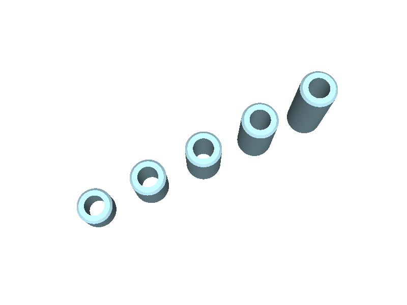

`projects/standoffs/spacers.py`: an M3 unthreaded spacer, 6 mm OD, chamfered,
in whatever length. It exports a 5/8/10/12/15 mm ladder and each length on
its own. Small, but it's the part every board project needs, and it reads
the same clearance constant as everything else, so when the coupon changes
that constant the spacers change with it.

### Standoff plate

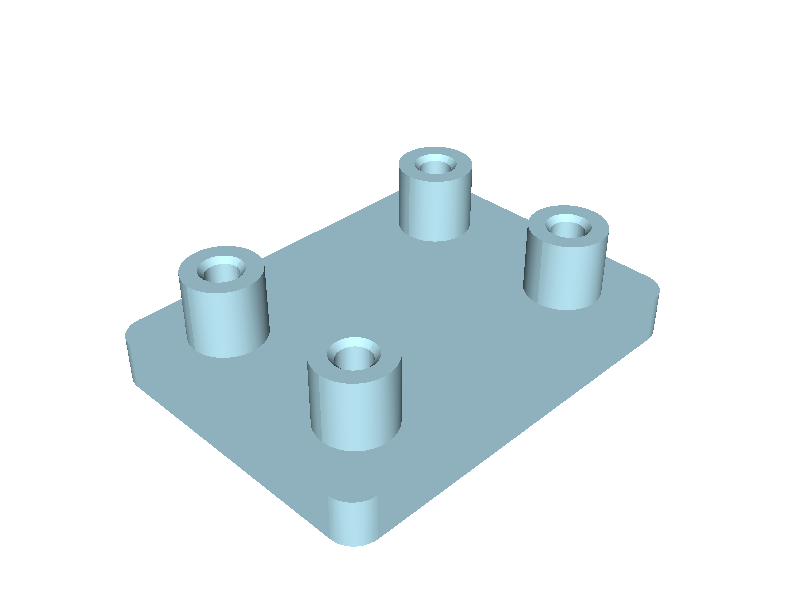

`projects/standoff_plate/` carries one or more registry boards on printed
bosses with M2 screws and a hex nut captured in a pocket under the plate.
It is the worked example of the params convention. `params.py` holds the
screw and nut table (ISO 4032, ISO 4762), and `derive()` finds the standoff
height at which a stocked screw passes through the nut and stops short of the
bed face. `validate()` refuses a board whose hole diameter or pin keepout is
unknown, and refuses a two-hole board because the family has no rest for a
cantilevered edge. The board data came from Adafruit's published Eagle file
through `tools/board_from_eagle.py`, which also reports how close the header
pins sit to each mounting hole; that number, 3.81 mm on the ADS1115, is what
bounds the boss diameter.

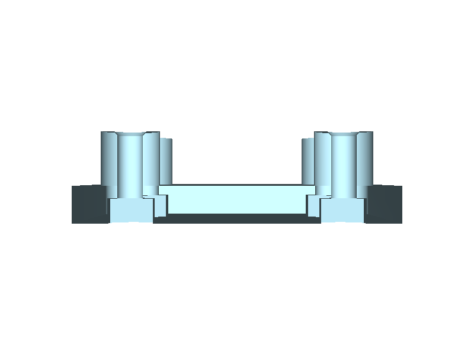

The same family makes the tray. `tray=True` adds walls to a rim derived from
the tallest thing on the board plus lid clearance, and every connector the
registry knows about gets an opening sized from its plug
(`cacad/registries/connectors.py`, from the JST SH datasheet). `validate()`
refuses a layout where a connector faces another board closer than the plug
plus finger room, which is exactly what the first tray did.

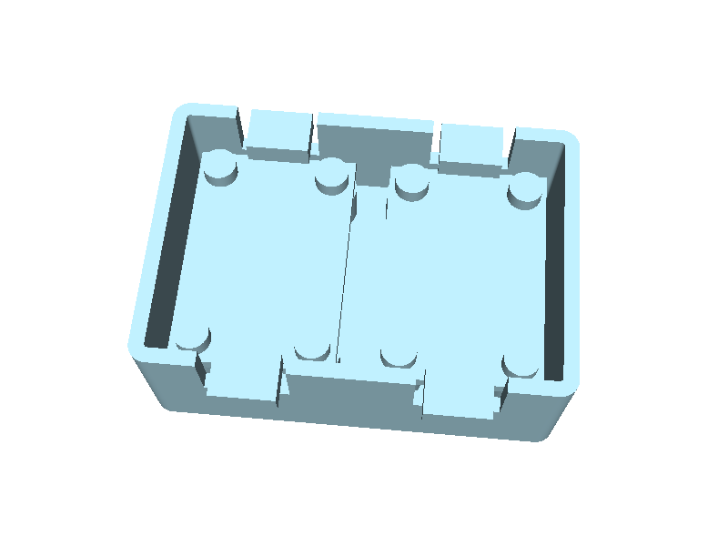

Adding a board is one command against the vendor's Eagle file. The INA219,
TCA9548A, BME280 and Feather ESP32-S3 went in that way, and the first real
tray for the sensor box holds the INA219, two ADS1115 and the TCA9548A in
one column with every STEMMA QT mouth at a side wall. The Feather has its own
plate; it joins the tray once the USB-C plug envelope is in the registry,
because a wall opening for an unsourced plug is a guess.

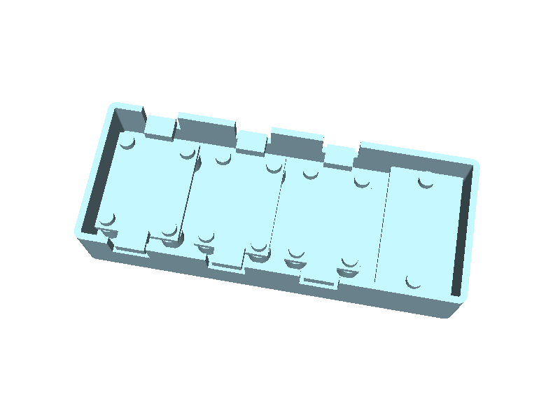

Newer plates carry the DFRobot SEN0244 TDS board and two Atlas EZO carriers,
with corner holes to screw the plate down.

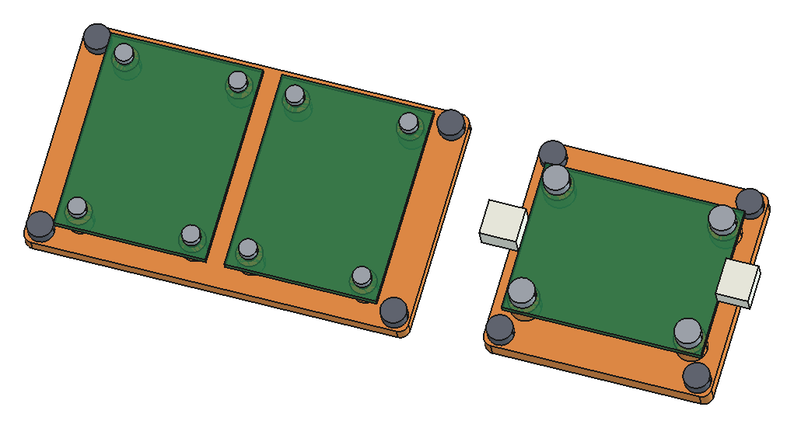

### Nutrient controller

`projects/nutrient_controller/` is a reservoir controller box: XIAO ESP32-C3,
analog TDS through an ADS1115, a DS18B20, one peristaltic pump, an OLED with
three buttons. It hangs beside any tote or bucket on a printed clamp over the
rim, so the container is never drilled; a bolted-through-the-wall revision
stays in params as the alternative. Every bought part is sourced from a vendor
sheet or board file, and the assembly checks run the clamp across a 2 to 35 mm
container wall. Its README walks through the modelling approach and the
build123d methods. It supersedes the `archive/enclosure_atlas` spec, which was waiting
on caliper measurements.

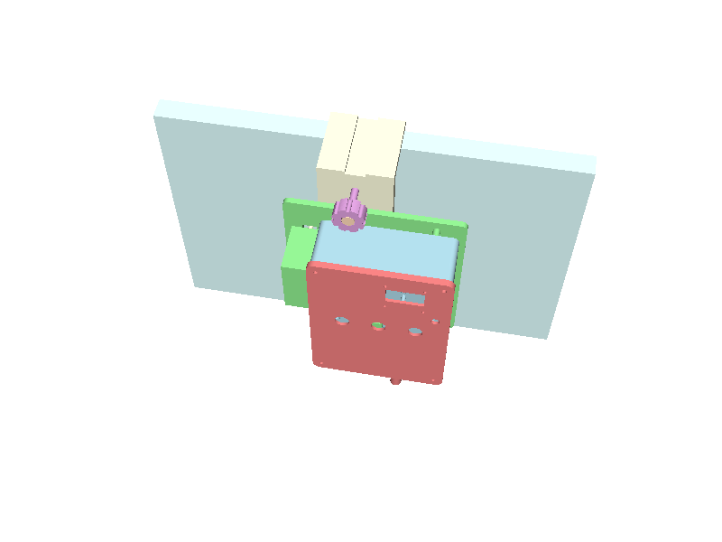

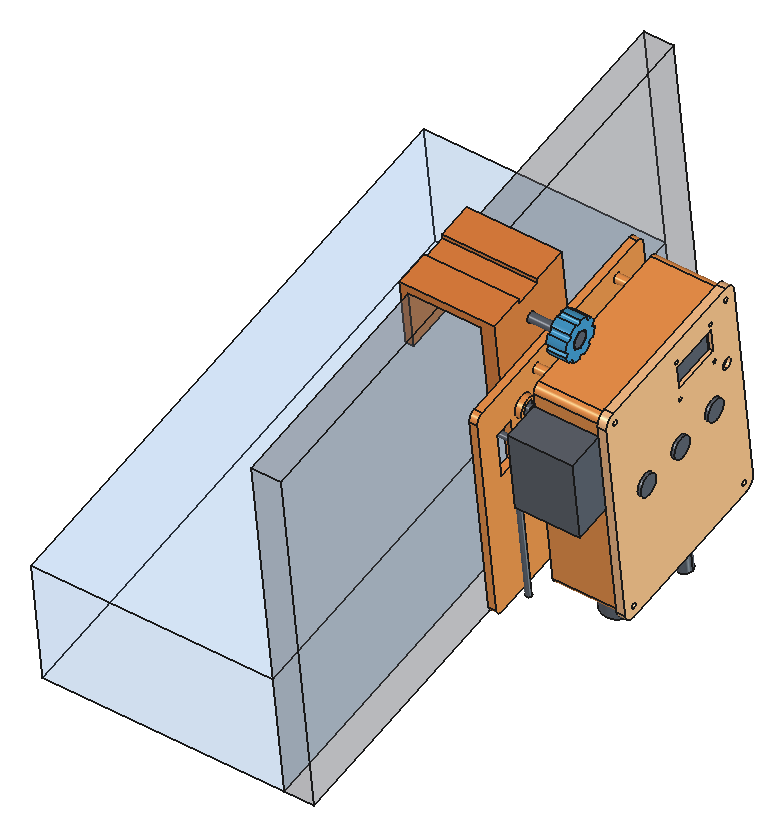

### SEN6x enclosure

`projects/sen6x_enclosure/`: a two-part PETG box around Sensirion's own STEP
of the SEN6x air-quality sensor, with the cable led out under one wall.

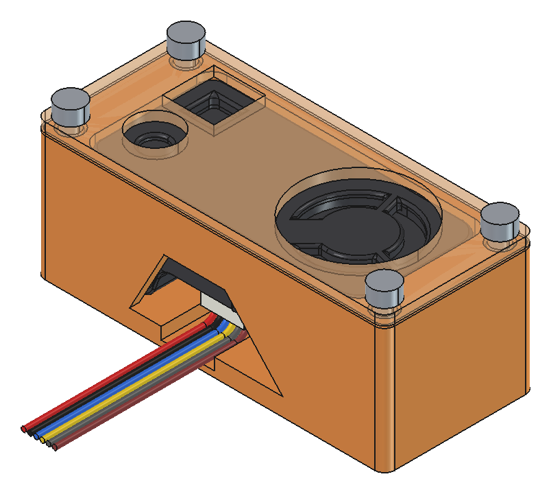

### Camera reader

`projects/camera_reader/`: printed optics that turn a bought Pi 4B + Camera v2
stand into a cuvette photometer.

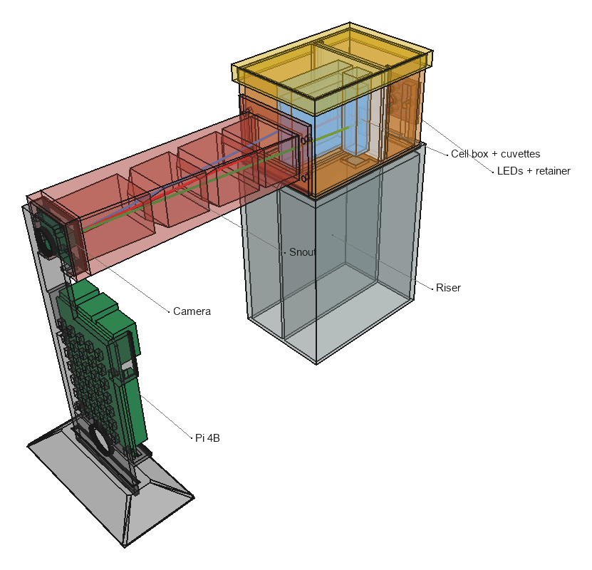

### Leaf imager

`projects/leaf_imager/`: a dark chamber that images a leaf under five LED
bands for NDVI. See its `SPEC.md`.

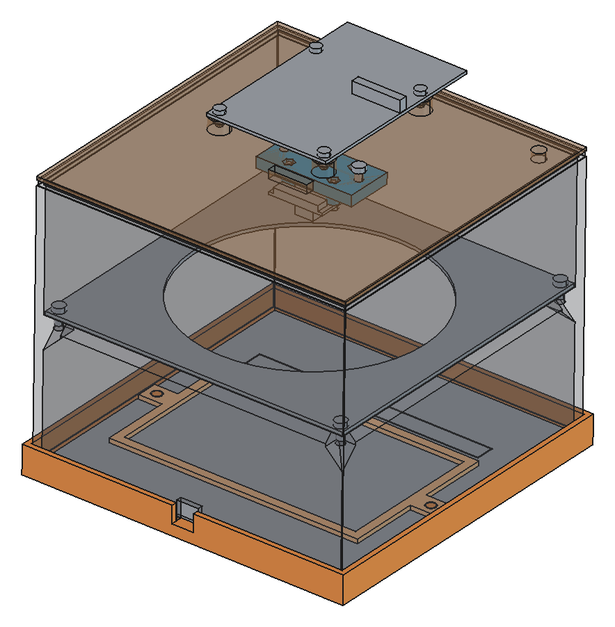

### Larger assemblies, not printed

The same conventions (one `params.py`, analytic checks, FreeCAD as the viewer)
drive three things that are bought and cut, not printed. Their manufacturability
layer is cut plans, screw lengths and where each number came from.

- `projects/tote_rack/`: a lumber rack where totes hang by their rims and slide out like drawers.
- `projects/raised_bed/`: a cedar fence-picket bed.
- `projects/nft_table/`: a one-level hydroponic NFT table: six Growrilla
  channels on a 2040/2020 frame, Sch 40 PVC supply and return, an HDX tote, and
  printed PETG parts wherever a bought part's geometry is unpublished. Every
  value is tagged as a standard, a vendor sheet, inferred, or a design choice.
  The first version (an AM Hydro three-level rack and this table, both caliper-
  gated) is in `archive/nft_rack_v1/`.

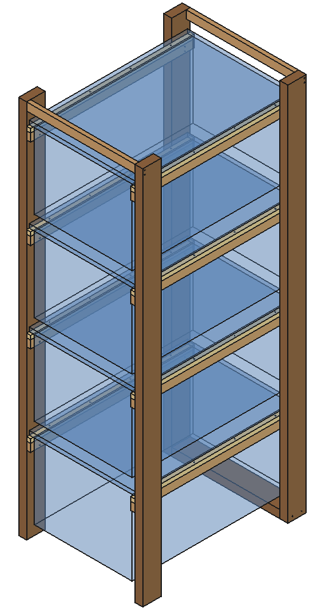
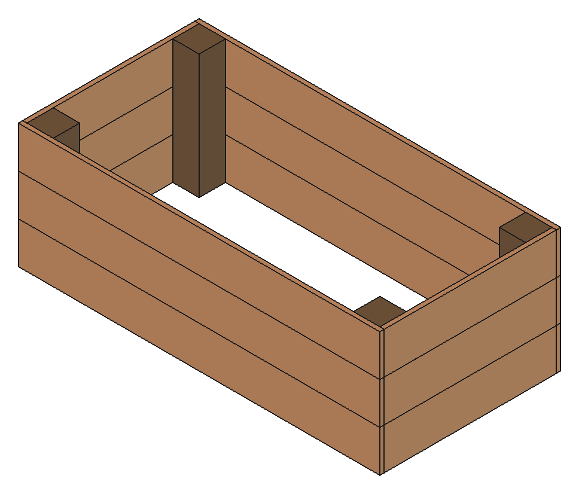
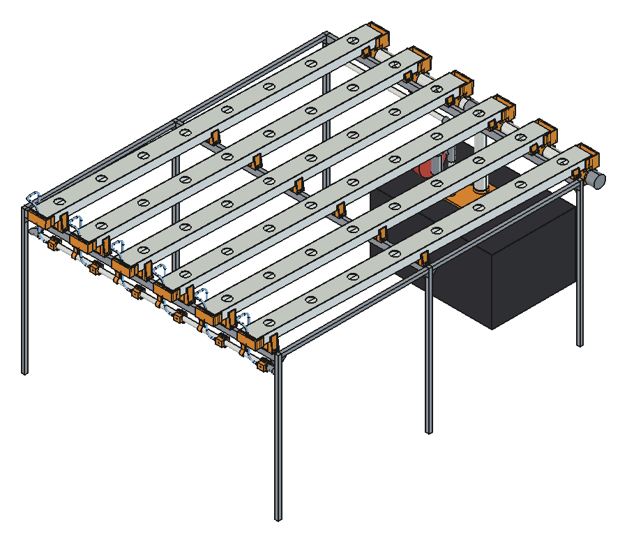

## build123d

build123d is a Python interface to the OpenCascade BREP kernel, for 2D and
3D. A part is code: a box, a fillet, a hole pattern at the coordinates a
registry supplies, exported to STEP or a mesh.

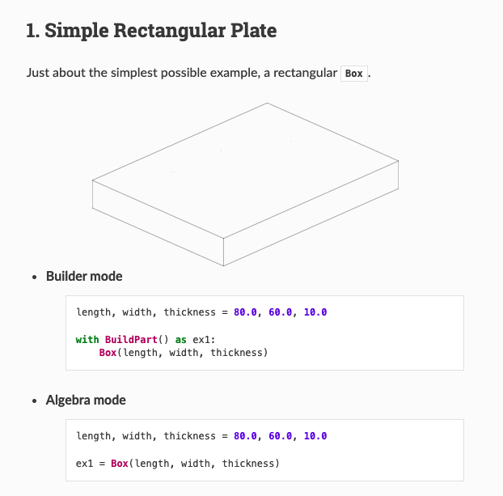
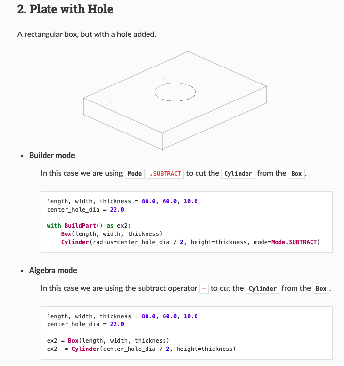

For this repo that matters in two ways. A part written as code is
parametric by construction, so a change to one number rebuilds everything
that depends on it, and an agent can write, run and test it without a GUI.
It also has real limits: no constraint solver, weak assembly support, and
the kernel has behaviours you only find by hitting them, which is what
`docs/FINDINGS.md` is for. The
[introductory examples](https://build123d.readthedocs.io/en/latest/introductory_examples.html)
are the fastest way to see what the code looks like.

## FreeCAD and KiCad

FreeCAD has three jobs here, all through the `freecad-mcp` addon's RPC
server. It is a viewer a person can click around in. It is the KiCad bridge:
a board goes through KiCadStepUp to a frozen STEP (`cacad.freecad.kicad_freeze`),
so an enclosure can be checked against the real board and, when needed, take
its outline from it. And it is a second implementation for checks: a part's
STEP is imported, placements are recomputed from `params` inside FreeCAD, and
a BOP check runs on every solid from both the STEP and the exact BREP, so an
exporter artefact can be told from a real defect. FreeCAD 1.1.3 and build123d
both run OpenCascade (7.8.1 vs 7.9.3), so this is a second code path, not a
second kernel, and any comparison includes a case that must disagree.

What FreeCAD does not do is compose geometry. Nothing drawn there becomes
source; if a part is wrong, the fix is in its `.py`. Setup is manual: open
FreeCAD, pick the MCP Addon workbench, press **Start RPC Server**, every
launch. Each call gets about 90 seconds of GUI time.

## Choices worth knowing

**Code-first over FreeCAD composition.** The first plan had FreeCAD doing
assembly. That path needed a button press per launch, a GUI-thread timeout,
and an opaque binary file in git, while build123d caught the same collisions
with none of that. FreeCAD kept the jobs it does well.

**Registries instead of numbers in parts.** `cacad/registries/boards.py`
holds a board's outline, hole pattern and keepouts once, with its source, and
every part that mounts that board reads it. A wrong number gets fixed in one
place. Constants in each part file is how a 0.7 mm hole error from a
community STEP model would have spread.

**Vendor files over calipers where they exist.** The ADS1115 entry was a
caliper TODO for a week. Adafruit publishes the Eagle board file; parsing it
gave the outline, four holes, the 2.5 mm plated drill (so M2, not M2.5) and
the pin keepout in one command, and showed the older two-hole revision is a
different board.

**pytest over the MCP server's analysis.** build123d-mcp renders, finds holes
and estimates printability, and it's useful for a look. A check in a test
file is versioned, deterministic and runs without a session, so the tests are
the source of truth and the MCP tools are the second opinion.

**Findings as reproductions.** Each `docs/FINDINGS.md` entry is pinned to the
library versions it was seen on and carries a snippet that prints `PASS`
while the behaviour holds. A gotcha list rots; a snippet says when the
workaround can go.

**Archive over delete.** The cable gland (below) is out of the way but its
findings and numbers are intact under `archive/`.

## Archived: parametric cable gland

The repo's first project was an M16 panel-mount cable gland with printed
threads, a slotted collet and TPU seal inserts. It produced most of the rules
in `CLAUDE.md` and the thread findings, and its first print didn't fit, as
the unmeasured coupon said it might. Printed threads and
seals are a different problem from mounting boards, so the project, the
`bd_warehouse` thread helpers and the thread findings are parked in
`archive/cable_gland/` and `archive/cacad_threads/`. They aren't tested and
aren't on the install path.

## Where it stands

2026-10-07: 177 tests pass on main. Nothing since the gland has been printed.
Caliper gates are gone: where a bought part's geometry is unpublished, a
printed interface is designed around it.

| project | state |
|---|---|
| standoff_plate | 8 plates and trays pass; 5 refused by rule |
| nutrient_controller | B2 rim clamp passes |
| sen6x_enclosure | passes, checked against the vendor STEP |
| camera_reader | V0 passes; LEDs not yet picked |
| leaf_imager | V0 passes, five printed parts |
| nft_table, tote_rack, raised_bed | pass; FreeCAD positions agree with params |

Known issues:
`cacad.export_3mf` reaches into two private `Mesher` methods, fine on
build123d 0.11.1 and maybe not after; FreeCAD's TechDraw section view has
taken FreeCAD down three times on multi-solid parts (F9), so sections come
from build123d-mcp's clip render instead; and the FreeCAD RPC server has to
be started by hand, which is the first thing to check when FreeCAD calls
fail.

## Setup

```
uv venv --python 3.12 .venv
uv pip install -r requirements.txt && uv pip install -e .
.venv/bin/python -m pytest -q                                  # the package and every project
.venv/bin/python projects/standoff_plate/params.py             # design review printout
.venv/bin/python projects/standoff_plate/plate.py              # -> projects/standoff_plate/out/
```

Python 3.12; the OpenCascade wheels don't exist for 3.13. Versions are
pinned to the ones `docs/FINDINGS.md` was observed on. Any part file runs the
same way and writes to its project's `out/`.

## Resources

- build123d: [docs](https://build123d.readthedocs.io/) and [GitHub](https://github.com/gumyr/build123d)
- build123d-mcp: the MCP server that runs, measures and renders parts in a session
- freecad-mcp: the RPC server and addon workbench this repo talks to, https://github.com/neka-nat/freecad-mcp
- KiCadStepUp: the FreeCAD workbench that turns a `.kicad_pcb` into STEP
- PartCAD: a useful, not comprehensive, collection of parts and assemblies, mostly electrical and mechanical. I got the Arduino and Raspberry Pi models from here. https://partcad.org/repository
- bd_warehouse: parametric fasteners, flanges, pipes and threads for build123d, https://bd-warehouse.readthedocs.io/. Only the archived gland uses it now.
