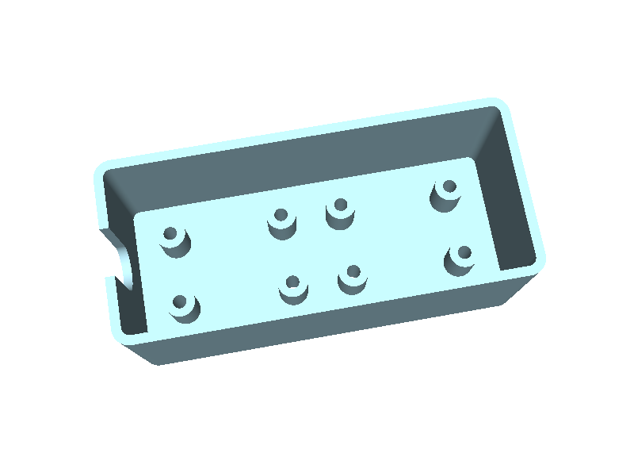
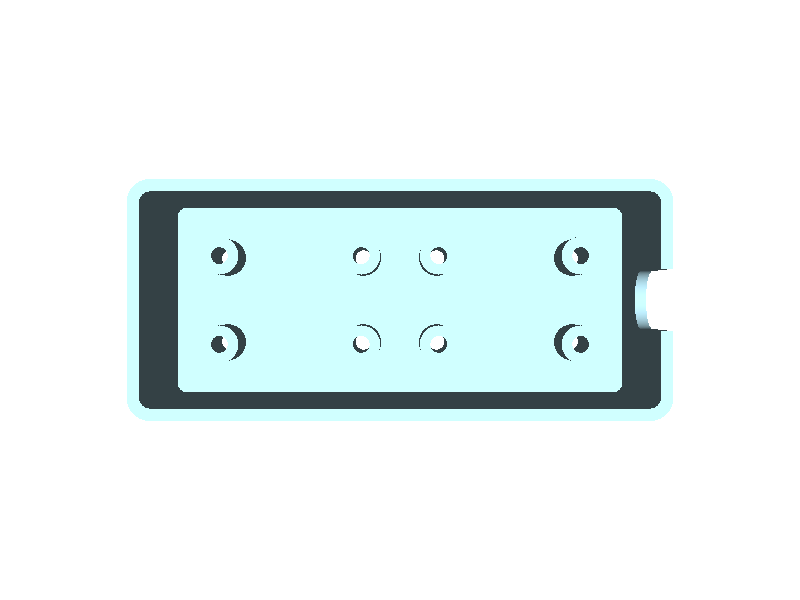
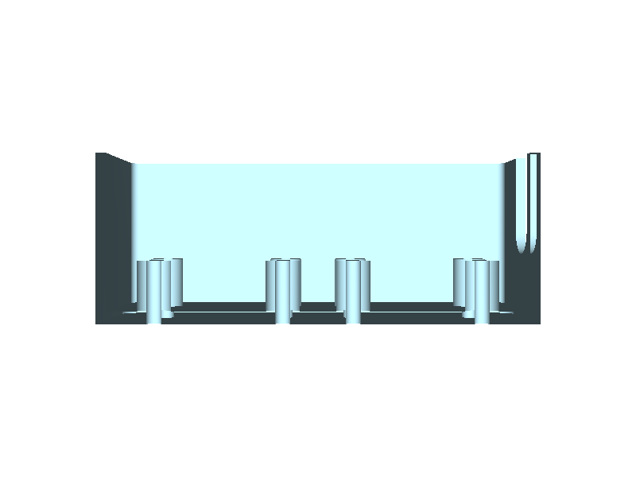
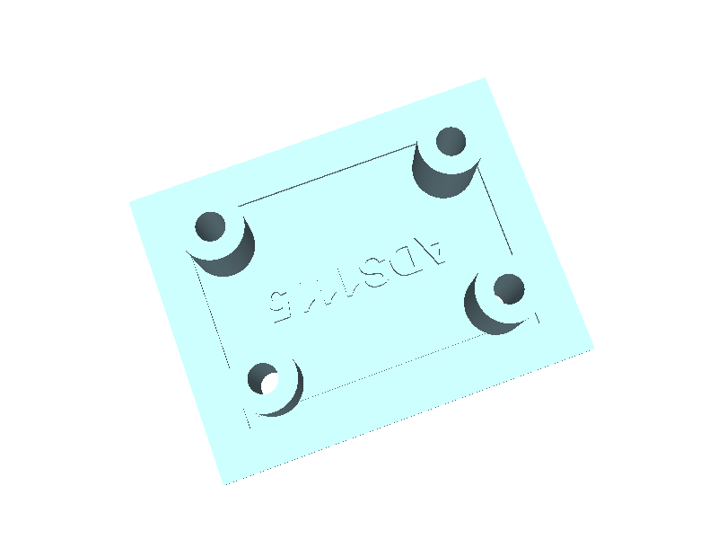

# mount_plate review and rescope (2026-09-20)

`mount_plate.py` and `enclosure.py` as they stand, rendered from the session
build (the STLs in `out/` are meshes of the same solids), with every defect
that the build123d validity gate, the bounding box and augura's printability
pass all miss. Both files are valid single solids with zero overhang
findings. Neither would hold an ADS1115 the way the registry says the board
is built.

## Defects

Numbers are from `cacad.registries.boards.ADS1115` (Eagle file, 2026-09-20)
and from probing the built solids in the session.

1. **Nothing holds the screw.** Eight Ø2.40 bores run straight through the
   2.0 mm floor (`find_holes`: 8 × through, depth 10.0; probe at z = 1.0 under
   each hole: air). No nut pocket, no insert bore, no head recess. A nut under
   the floor stops the tray sitting flat; a nut on top of the board needs an
   M2 × 12 that then protrudes 0.4 mm below the floor (2 + 8 + 1.6 = 11.6).
   Same on `mount_plate.py`.
2. **The two boards' STEMMA QT connectors face each other across 6 mm.** The
   JST SH4 connectors are at x = ±10.03 on the board's short ends, opening
   outward (`CONN3` rot R90, `CONN4` rot R270). The tray places the boards
   end to end at ±15.7, so the inner connectors look at each other across a
   6.0 mm gap and the outer ones look at a wall 5.0 mm away. No STEMMA QT
   plug fits either space (housing length: JST SH datasheet, not yet in the
   registry). The only cable route is the rim slot at +X, above the boards.
3. **Boss diameter is a convention, not a derivation.** Boss OD = bore + 3.0
   = 5.40 (r 2.70) against `nearest_pin` 3.81: 1.11 mm from a header pin
   centre, so the boss top lands under the solder fillet of the outer header
   pins. It happens to clear by the standoff plate's margin (1.0) but nothing
   checks it.
4. **Standoff 8.0 is unexplained.** The comment says "boss 8 + board + header
   + plug"; no header tail length or plug height is in the registry. The
   standoff plate's derivation gives 5.2 for the same board (4.5 underside
   need, raised to a stocked M2 × 10). Three extra millimetres of height and
   screw for no stated reason.
5. **Wall height 25 and slot 8 × 12 are guesses.** `WALL_H` has no source;
   headroom above the board top is 15.4 mm. `SLOT_W = 8.0` is marked "guess
   until a cable is measured". The slot bottom (z = 15.0) is 3.4 mm above the
   board top, so a cable to a STEMMA connector has to bend down inside the
   wall.
6. **The label is under the board.** `mount_plate.py` embosses `ADS1115`
   0.6 mm tall at the board centre, inside the outline groove. With bosses it
   is hidden; in the `flat` variant the board sits on the letters and rocks.
7. **The outline groove crosses the bosses.** Holes are 2.54 from the board
   edge and the boss radius is 2.70, so the 0.8 mm groove cuts across each
   boss footprint (visible in the render). F20's void fix hides the geometry
   problem; the groove and the boss want different radii.
8. **No params, no tests, no function layer.** Every number is a module
   constant; nothing places the board, screws or nuts and intersects them;
   nothing measures walls on the geometry. The floor is 2.0 (`FLOOR` in
   materials is 1.2, `WALL` 1.6), also unexplained.

Also found while probing: `cacad.min_section_wall` reports the bbox extent
for a section whose outer wire is cut open (the tray ring at slot height has
no inner wire), so it cannot see the wall beside the slot. Probe limitation,
noted for `cacad`.

## Rescope — started 2026-09-20

Done in `projects/standoff_plate/` the same day: `tray=True` on a plate
grows walls to a derived rim, `Board.connectors` (from the Eagle file) and
`cacad.registries.connectors` (JST SH datasheet) give each connector a
plug envelope, `validate()` refuses a connector that faces a board closer
than plug + finger room (the old two-board layout fails exactly there), each
connector that faces a wall gets a U-opening sized from its plug, and the
function tests place boards, screws, plugs and the unplugging reach and
intersect them with the tray. `ADS1115x2_tray` is active, built, tested and
rendered (`docs/img/standoff_tray*.png`). Not done: a lid, a rest for
two-hole boards, any caliper value, the coupon.

The plan as written before the work:

Retire `mount_plate.py` and `enclosure.py` as designs; keep them as the
first sketch in git history. The standoff plate already does the plate half
correctly (bought-part table, nut pocket, screw ladder, board keepouts,
tests). The enclosure becomes a variant of that family, not a second
implementation:

- `projects/standoff_plate/` gains a `tray` option: walls of `WALL` rising
  from the plate to a derived height, corner radius, and cable or connector
  openings placed from the registry, never from a guess.
- `Board` gains what the tray needs and the Eagle tool can supply:
  connector positions, facing and type (`connectors=((x, y, facing,
  "JST_SH4"), ...)`), header rows and side. The two facts that need a
  datasheet or a caliper, not the board file, are the STEMMA QT plug
  envelope (JST SH) and the header tail length as soldered; both go in a
  small connector/hardware registry with their source.
- Placement is derived from the connectors: boards go side by side along
  their long edges (headers facing) or end to end with the connector-side
  gap ≥ plug envelope + finger room, and `validate()` fails when a connector
  faces a wall or another board closer than that.
- Wall height derives from the tallest thing on the board (connector or
  header, from the registry) plus the lid clearance; the cable opening is
  sized from the cable or the plug, at the connector's height, not the rim.
- The two-board ADS1115 tray is the first active size, replacing
  `ADS1115x2`. `enclosure_atlas` then reads this family instead of starting
  its own.

Before any geometry: the JST SH plug envelope and the header tail go into
the registry with sources, and the coupon prints so `screw_clearance` and
`nut_pocket_clearance` stop being guesses.
