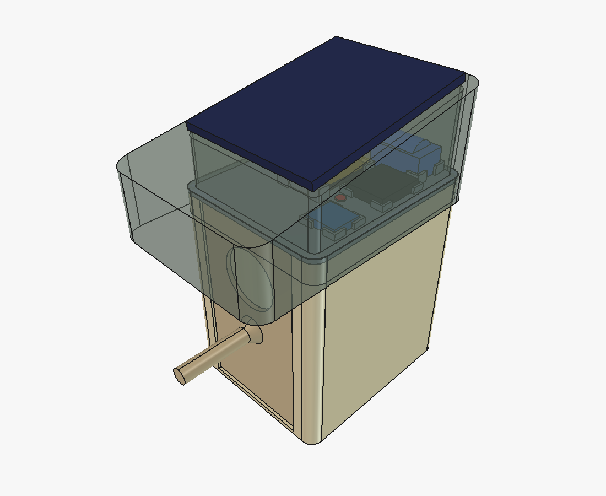
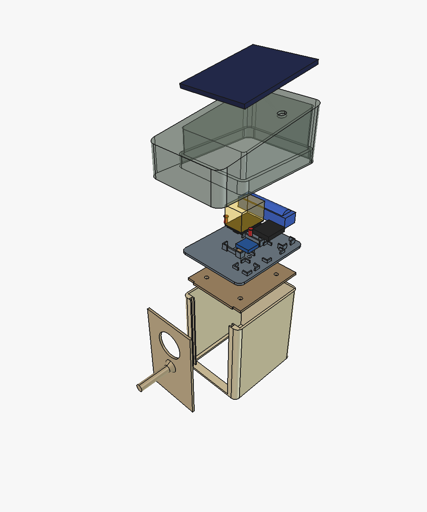
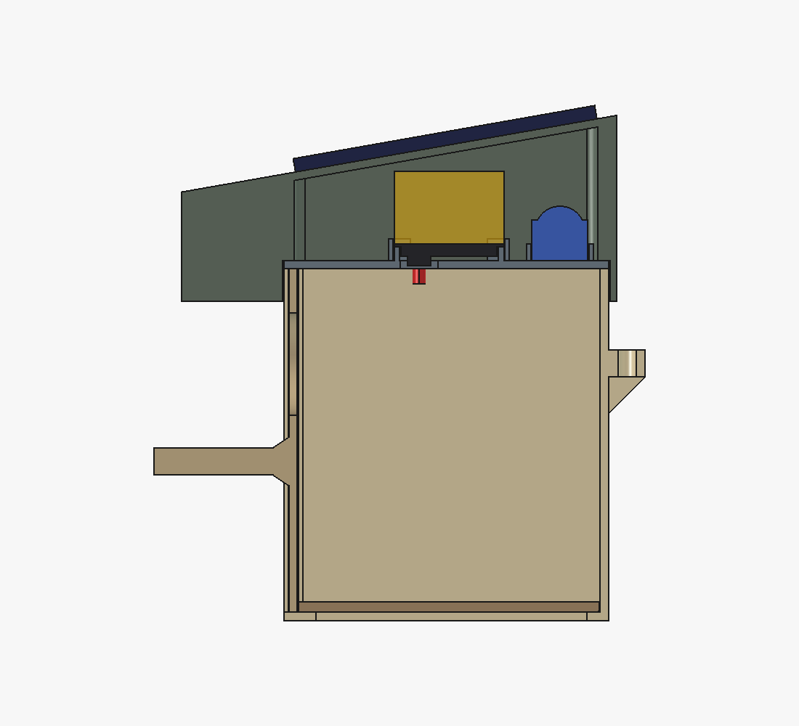

# birdhouse

A solar nest box with an ESP32-CAM in the roof. It wakes every 10 minutes,
lights the nest with 850 nm IR, takes one frame, uploads it and switches
itself off. Nothing has been printed or wired yet.

This rebuilds "Nisthaus Vogelhaus Nistkasten ESP32-CAM V1" by Juchala
(CC BY-NC-SA) as parametric build123d, using its proportions. None of its
meshes are reused. If you publish this design, the license carries over:
credit Juchala, non-commercial, share-alike.







## Status

Concept. `validate()` and the `assembly.py` checks pass, but nothing is
printed or wired, and the tray holds boards whose sizes are estimates marked
UNVERIFIED (the bq25185 board, the ESP32-CAM's shield and lens). The largest
open risk is charging below 0 °C. DESIGN.md lists what is not verified, the
power budget and the wiring.

## Sources

Every number in `params.py` is a `(value, TAG, source)` triple and
`validate()` refuses an untagged one. Proportions from Juchala's reference
(meshes not reused); the timer and panel from Adafruit's product pages (3435,
3809); the cell from Samsung's 30Q spec and its holder from Digi-Key; IR LEDs
from Vishay's TSHG6400 sheet; the bolt ISO 4017; fits from
`cacad.registries.materials`. The charger board's size, the camera's optics,
December sun and wake time are estimates.

## Run

```
.venv/bin/python projects/birdhouse/params.py            # design, energy budget, pin map; validated
.venv/bin/python projects/birdhouse/assembly.py          # checks + out/*.step, *.stl, V0.3mf
.venv/bin/python projects/birdhouse/freecad_assembly.py  # out/birdhouse_V0.FCStd with an exploded view
.venv/bin/python -m pytest projects/birdhouse
```
