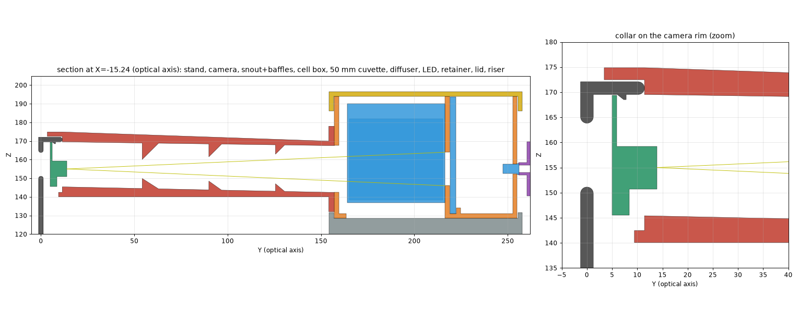

# camera_reader: the design

The optics, the light leaks to close, what the assembly checks prove, and the
hardware to buy. The front page is `README.md`.

## The optics

```
camera pocket -> snout: collar on the pocket rim, 143 mm tunnel, 3 baffles
  -> cell box: [REF | 50 mm | 10 mm] against the masked datum wall
     -> 3 mm opal diffuser -> 30 mm white-lined cavity -> 7 LEDs + retainer
```



- **The stand sets the axis.** The lens sits 155.0 mm above the table. The
  riser is derived from that, so the box needs no adjustment.
- **The collar locates the snout and carries no load.** It slides 8 mm over
  the camera pocket's rim (0.4 mm fit) and stops on it. The box and riser
  carry the weight.
- **The 50 mm cell sits on the axis.** Its rays run 52.5 mm through the
  liquid. Off-axis, they hit its side wall. `validate()` checks that every ray
  from the lens pupil to each window stays inside that cell's 10 mm of liquid
  and misses the other cell.
- **Cells register against a datum.** Each cuvette's far face bears on the
  mask wall, and the pockets give 0.4 mm side play.
- **The LEDs are clamped, not pressed.** Each LED flange is squeezed 0.2 mm
  between the back wall and a retainer nub. The retainer is held by two M3
  screws in heat-set inserts.

At the datum the camera resolves 6.7 px/mm in the 2×2 binned mode, so each
7 × 18 mm window gives about 5,700 px. The spec hoped for "tens of
thousands". Getting there means moving the cells closer or making the windows
bigger, which is a decision for after E1.

## Light leaks you have to close

- **Rear hole.** The stand has a Ø14.6 hole in its plate right behind the
  camera. Put black tape over it.
- **Ribbon notch.** Close the collar's ribbon notch with a felt flap around
  the ribbon.
- **Lining.** Line the snout and the box's cell compartment with black
  flocking. Line the LED cavity with white film. Black PETG passes some NIR,
  so the 850 and 940 nm channels need the lining.

The read sequence's dark frame measures whatever leak is left.

## What the assembly checks prove

The assembly checks are:
- all 19 parts clear pairwise;
- the seven designed contacts touch;
- every window's light reaches the lens past every printed part;
- the collar wraps the rim;
- overhang is checked at 45° in each part's print orientation, with the two
  bridges declared.

As a cross-check against the real meshes rather than the envelope, FreeCAD
measured the snout against the stand upright: 0 mm³ overlap at 0 mm
distance. Three small overlaps sit within the bought parts themselves:
- Pi/upright, 0.11 mm³, and upright/base, 0.08 mm³: mesh facets at the
  contact faces.
- Camera/upright, 0.41 mm³: the stand's retention lip laps over the camera
  board's edge. That lip is how the stand holds the camera.

## Hardware to buy

- **Flange:** 4 × M3 × 10 ISO 7045 screws and 4 × M3 ISO 4032 nuts.
- **Retainer:** 2 × M3 × 8 ISO 7045 screws and 2 × M3 heat-set inserts
  (CNC Kitchen standard).
- **Diffuser:** opal acrylic cut to 60.5 × 62.6 × 3 mm.
- **Lining:** felt or flocking, plus white film.
