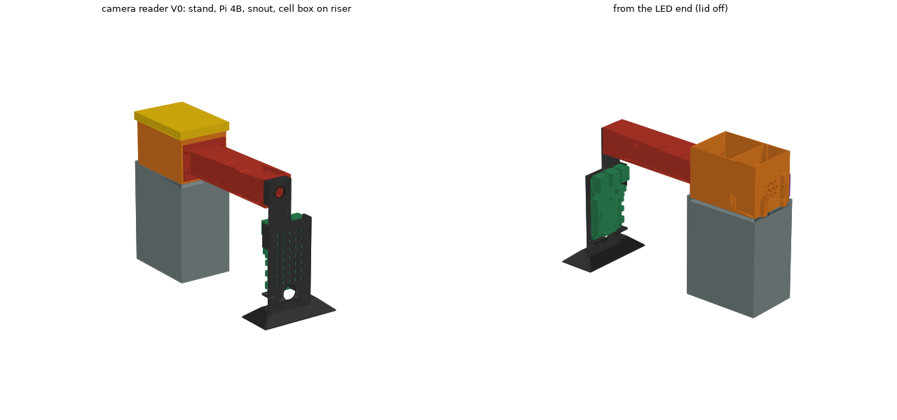

# camera_reader

The bench optics for the camera absorbance reader v0 (spec:
`ref/camera-reader-v0.md`). A Pi 4B and a Camera Module 2 NoIR stand in a
bought dev stand. Five printed PETG parts turn that stand into a photometer:
a snout from the camera to a dark cell box, the box itself, an LED retainer, a
lid and a riser that holds the box at lens height. Nothing has been printed
yet.



`DESIGN.md` has the optics, the light leaks to close, the assembly checks and
the hardware to buy.

## Status

STATUS is `passes`: V0 validates and its assembly checks pass (details in
`DESIGN.md`). Nothing has been printed. Open:

- LED part numbers. The LED hole and retainer nubs follow the generic 5 mm
  LED until a datasheet replaces it.
- The 10 mm cuvette vendor.
- A leaf spring that pushes each cuvette onto the datum, if E1 shows
  repositioning error.
- Lighter riser: it is 141 cm³ (~180 g PETG) as drawn.

## Sources

What is bought, and where each number comes from. The spec itself
(`ref/camera-reader-v0.md`) is unpublished and gitignored.

| Part | Source of every number |
|---|---|
| Stand (upright + base) | elric's "Dev stand for Raspberry Pi and Camera Module 2", MakerWorld. Standard Digital File License, so the meshes stay in gitignored `ref/stand/`. The numbers in `params.STAND` were measured by sectioning the meshes. The designer worked in inches, so every level is a round fraction (slot floor 0.200 in, camera seat 0.245 in). |
| Pi 4B | Raspberry Pi drawing RP-008343: outline, holes and every component height (the drawing's Z labels). Component extents are scaled off the drawing, not dimensioned. PCB thickness is UNVERIFIED. |
| Camera Module 2 NoIR | Raspberry Pi drawing RP-008149 (outline, holes, lens position) and the docs spec table (9 mm depth, 62.2 × 48.8° FOV). |
| 50 mm cuvette | MSE Supplies LS4035 product data: 45 × 12.5 × 52.5, 10 mm inside width, 17.5 ml. |
| 10 mm cuvette | Standard 12.5 × 12.5 × 45 macro cell. UNVERIFIED until a vendor is picked. |
| LEDs, diffuser | Generic 5 mm LED (UNVERIFIED; the spec still has to pick parts). Diffuser is 3 mm opal acrylic, cut by you to `params.py`'s printed size. |

Raspberry Pi publishes no STEP for the Pi 4B or Camera Module 2, only
drawings, so `hardware.py` builds both from the drawings and exports
`out/pi4b_local.step` and `out/cam_v2_local.step`.

## Run

```
.venv/bin/python projects/camera_reader/params.py           # the design, printed
.venv/bin/python projects/camera_reader/assembly.py         # checks + out/*.step, *.stl, V0.3mf
.venv/bin/python projects/camera_reader/freecad_assembly.py # out/camera_reader_V0.FCStd (needs the RPC server)
.venv/bin/python -m pytest projects/camera_reader
```

Without the GUI, `freecad_assembly.py` prints a one-line `freecadcmd` call that
builds the same document headless. The FreeCAD document is a real Assembly
(FreeCAD 1.x workbench): the stand meshes become solids, the boards come from
their local STEPs with placements from `hardware.py`, and the upright is
grounded.
