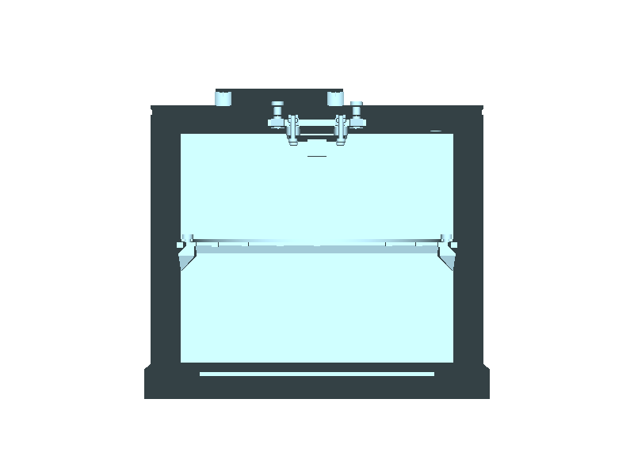
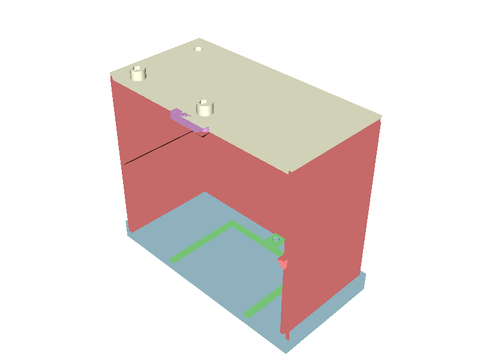

# leaf_imager

A leaf NDVI imager (spec: `SPEC.md`). A Camera Module 2 NoIR looks straight down
at a leaf 100 mm away, inside a dark chamber. A ring of LEDs lights the leaf at
45°, one band at a time: 450, 525, 660, 730 and 850 nm. Each frame becomes a
per-pixel reflectance map, then NDVI and NDRE. Nothing has been printed yet.





## Status

STATUS is `passes`: V0 validates, all five printed parts build, and the
assembly checks below pass. Open: the first print, stock for every LED at
order time, and the light-leak lining (below).

## Sources

`SPEC.md` is the authority: it names the question, the acceptance criteria and
every bought part. Each number in `params.py` carries a tag (VENDOR, STANDARD,
INFERRED, DESIGN, NOTES, UNVERIFIED) and its source; UNVERIFIED values such as
LED stock and the camera's back-side connector height never pass a part that
has to fit.

## How you use it

1. Lift the chamber off the base. It carries the roof, camera and Pi with it.
2. Lay the leaf on the platen. A leaf still on its plant goes in with its
   petiole through the front notch.
3. Drop the hold-down frame over its two pins.
4. Lower the chamber back into the base's rim.

## Parts

Five printed parts in PETG, one file each:
- `base.py`
- `chamber.py`
- `hold_down.py`
- `roof.py`
- `carrier.py`

`params.py` holds every number with its source. `hardware.py` models the bought
parts as envelopes: camera, Pi, LED board, PTFE strip, lining and fasteners.
The fasteners are listed in `SPEC.md` under *Parts*.

## Run

```
.venv/bin/python projects/leaf_imager/params.py     # the design, printed and validated
.venv/bin/python projects/leaf_imager/assembly.py   # assembly checks + out/*.step, *.stl, V0.3mf
.venv/bin/python projects/leaf_imager/freecad_assembly.py   # out/leaf_imager_V0.FCStd, exploded view (needs the RPC server)
.venv/bin/python -m pytest projects/leaf_imager
```

`assembly.py` checks that:
- all 18 parts and hardware pieces clear each other pairwise;
- the 9 designed contacts touch;
- the camera's view meets only the leaf plane and the hold-down frame;
- light from all 20 LEDs reaches the field centre, the uniformity corners and
  the strip corners (180 rays);
- each part stands on its declared bed face with no overhang over 45° except
  three declared bridges.

## Light leaks you have to close

- **Roof:** a felt flap over the ribbon slot and over the LED cable hole.
- **Petiole notch:** foam in the notch, in the chamber wall and in the base rim.
- **Lining:**
  - Line the platen with an NIR-dark black (≤ 3 % at 850 nm; see `SPEC.md`).
  - Line the hold-down frame's top the same way. It is in the picture, and
    black PETG can be bright at 850 nm.

The dark frame in every read measures whatever leak is left.
