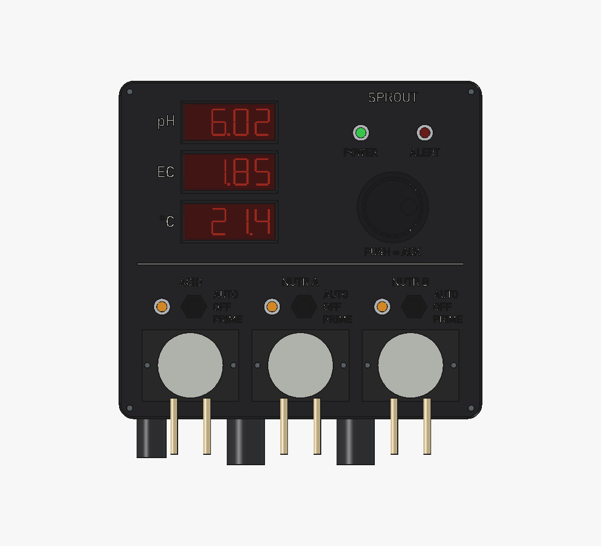
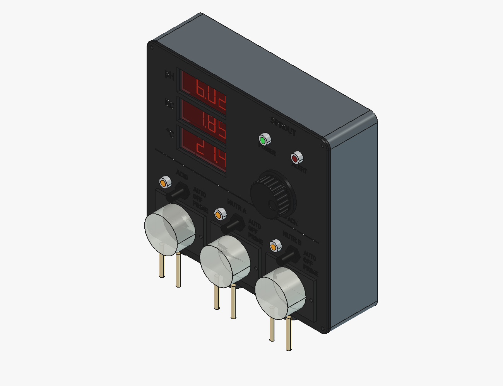
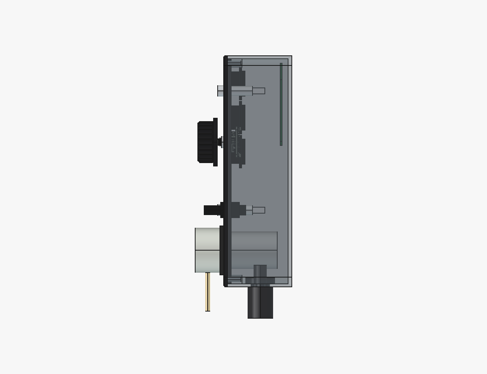

# nutrient_controller: the design

The three concepts, the box, and the B1 and B2 mounts. How it was built is in
`MODELLING.md`; the parts list, placeholders and log are in `NOTES.md`.

## Concepts

Three rough concepts, all on the HDX 27 gal tote, each holding the same
electronics as envelopes:

| | A: box on the lid | B: box on the end wall | C: screen on a post + box on the lid |
|---|---|---|---|
| lid lifts off alone | no | yes | no |
| lowest opening over the waterline | +160 mm | +100 mm | +160 mm |
| TDS probe cable to spare | +420 mm | +480 mm | +158 mm |
| holes in the tote | 7 in the lid | 4 in the wall | 3 in the lid |

B went forward: it is the only one where taking the lid off leaves the
probes, the tube and the electronics where they are.

## The box (B1 and B2)

The box is 110 × 150 × 44 mm and prints on its back. Inside are:
- the DFRobot SEN0244 TDS board, with an ADS1115 reading it;
- the Adafruit MOSFET driver for the pump;
- a Perma-Proto carrying the XIAO ESP32-C3 and the Pololu 5 V regulator.

Each board sits on bosses whose height is derived from a stocked screw. A
nut pocket opens to the back face, and the boss is raised until an M2 × 10
ends inside its nut and 0.4 mm short of the back. The Kamoer NKP pump bolts
outside the left wall with its motor inside. Its tubes leave the head
towards the wall, so no liquid enters the box.

Cables come in from below through Lapp glands, with a drip loop. The M16
gland for the TDS probe is sized so the probe's XH plug (9.3 mm diagonal)
passes through it open. The cover carries the OLED behind a window, three
IP67 buttons and the LED, and has a 3 mm drip skirt over the body's edge.
The box hangs by three keyholes on mushroom posts on a printed plate and
lifts off for service.

## B1: plate bolted through the wall

The post plate bolts flat to the tote's end wall with four M5 bolts through
a backing plate inside the tote. The probe cables leave the tote through one
hole behind the plate. Every hole in the tote sits at least 50 mm above the
waterline. It is the stiffer mount and the cleaner lid, but it means drilling
one particular tote. It stays in `params.py` as the alternative: validated,
not built.

## B2: rim clamp (active)

The post plate bolts to a printed C-hook through two vertical slots, which
set the box top anywhere from 29 to 41 mm below the rim. The hook's bridge
sits on the rim and its inner jaw bears on the inside face. An ISO 4017
M6 × 60, turned by a printed knob, presses a printed pad on the outside. The
throat takes any wall or lip from 2 to 35 mm thick at the screw. The hook is
60 mm wide, so a bucket rim of 150 mm radius leaves only a 3 mm gap across
it. The probe cables and the dosing tube cross the rim in a 16 × 3 mm groove
on the bridge, then run down outside to the glands. The hook prints upside
down on its bridge, so the jaw and leg are plain walls on the printer.

## Concept D: the instrument panel

A redesign of B2's front for the whole analog node: pH and TDS on one ADS1115,
water temperature, three pumps (acid, nutrient A, nutrient B). It replaces the
OLED, the three buttons and the LED with an old-school instrument front.

**Why it beats the OLED.**
- **Glanceable.** Three 14 mm red 7-segment readouts behind red filters read
  across a grow room and in daylight. The 1.3 in OLED needs you at arm's length.
- **No burn-in.** An OLED showing the same three numbers all day burns in. LED
  segments don't.
- **Honest RUN lamps.** Each amber lamp is wired across its pump's terminals,
  so it lights when the pump has power, whatever the firmware believes.
- **A hardware override.** Each pump has an AUTO / OFF / PRIME toggle, wired
  in series with the pump. OFF stops it whatever the firmware does. PRIME runs
  it only while the lever is held down, which primes the line.
- **Pumps on the front.** Tubes are changed without opening the box. They hang
  straight down, so drips fall clear of everything and no liquid is inside.
- **Gloved or wet hands.** One 40 mm fluted knob and three toggles replace
  three 12 mm buttons.

**Layout** (204 × 190 panel, case 56 deep, on the A1 bed): readouts top left,
POWER (green) and ALERT (red) lamps and the knob top right, an engraved rule,
then three columns of RUN lamp, toggle and pump head. Legends are engraved
0.6 deep (three layers, bold DIN, at least 4 mm tall, F22) in the panel's bed
face. A filament change after layer 3 shows them in the second colour. The
windows are bevelled 45° at the front, because the digits sit 5 mm deep and
square windows hid them off-axis. The panel locates on a lip and screws to four
corner insert bosses. Cable entries are in the bottom wall, between and beside
the motors.

**Parts.**

| part | model | source tag |
|---|---|---|
| readouts | 3 × Adafruit 878, 0.56 in red 7-segment, HT16K33 I2C 0x70-0x72 | VENDOR (Adafruit STEP) |
| knob | Adafruit 4991 STEMMA QT rotary encoder (seesaw 0x36) | VENDOR (Adafruit STEP); M7 thread UNVERIFIED |
| lamps | APEM Q8P1CXX(Y/G/R)12E, 8 mm, chrome, IP67, 12 V | VENDOR (APEM datasheet) |
| toggles | C&K 7000 SPDT ON-OFF-(ON) + APM Hexseal boot | UNVERIFIED (datasheet refused scripted download) |
| filters | red cast acrylic, 2 mm, cut 58 × 27 | DESIGN |
| pumps | 3 × Kamoer NKP-DC-S06 | VENDOR (B2's row); head diameter UNVERIFIED |

**Firmware** (sprout-cut `nutrient-analog-xiao`):
- U8g2/OLED is replaced by three HT16K33 displays, and the seesaw encoder joins
  the same I2C bus. No new pins.
- ALERT moves to D7 through a fourth MOSFET 5648.
- Pump outputs become active-high for the MOSFET boards.
- Not yet solved: the firmware can't see a toggle set to OFF or PRIME. A dose
  it believes it ran may not have happened.

**What the checks caught while drawing it:**
- An M16 gland nut under a motor.
- The M12 nut in the case's rounded corner.
- The encoder bushing standing 2 mm past its nut into the knob.
- Four frame tabs on the encoder body that bear on the panel.
- The insert bosses breaking through the case's rounded corners.
- The panel lip's square corners in the case's rounded ones.
- Legends at 5.6 standing 3.99 tall, under F22's 4 mm.

**Open:**
- C&K's toggle drawing (hole, bushing, body).
- The encoder's thread and nut.
- The pump head diameter.
- The display backs (HT16K33 and header tails: 3.0 assumed).
- A display retainer.
- Teardrops on the bottom-wall holes for printing.
- Keyholes on the back to hang it on B2's post plate and rim hook (re-pitched).
- The 3.3 V budget for three displays.

## Limits

Nothing has been printed, so every DESIGN clearance is still untested in PETG.
Several bought-part numbers are PLACEHOLDER:
- every board's PCB thickness;
- the OLED panel's thickness;
- the TDS probe's cable diameter;
- the USB-C plug's overmold.

The design tolerates each one (the list and how is in `NOTES.md`), but none
has been confirmed.

B2 has two costs B1 doesn't. The lid rests on the hook's bridge, 6 mm high
there, and a snap-on lid won't latch at that spot. The TDS probe's 830 mm
lead is tight: 53 mm to spare on the HDX tote, 13 mm on a container whose
rim is 200 mm above the water, so anything deeper needs an extension. The
clamp holds by friction and one screw, which makes the hook the first part
for a `cad-design-review` pass.

The firmware (sprout-cut `nutrient-analog-xiao`) needs `activeHigh=true` for
the MOSFET driver. It has no button or LED pins yet.
