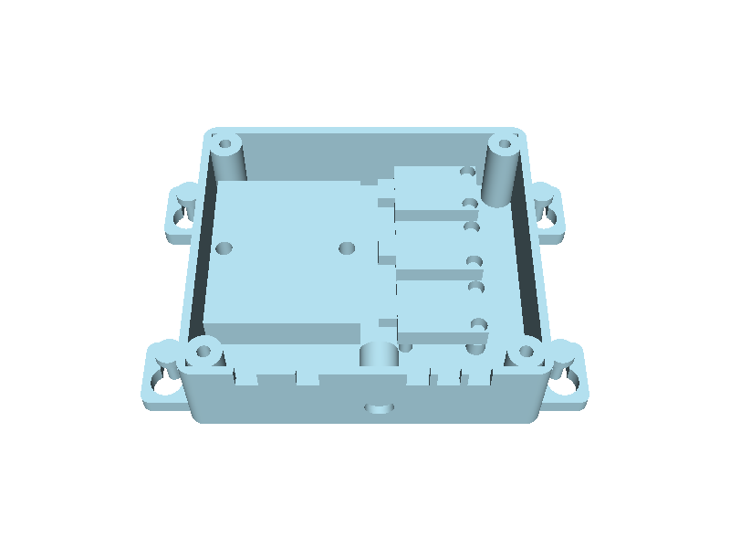

# nutrient_controller

Printed PETG housings for the analog nutrient node: pH and TDS through one
ADS1115, water temperature on a DS18B20, three dosing-pump outputs, all run by
a XIAO ESP32-C3 that reports over Wi-Fi. The active revision, **L1**, is the
lean one: two flat-mounted prints and a lid, no display, no buttons.

- **Analog plate** (`standoff_plate` ANALOG_NODE): SEN0244 TDS, ADS1115 and
  Surveyor pH in a row on one open plate, both probe connectors facing down.
- **Logic box** (`lean_box.py`): the XIAO + Pololu 5 V on their Perma-Proto,
  three MOSFET pump drivers and the 12 V jack, under a flat screw-on lid.



**Mounting.** Both parts screw flat with M4 or #8 pan-head screws. On a wall,
the probe leads and the box's cables hang straight down. Either part also
screws to a bench or shelf, or under a shelf or table top. The box hangs on
keyhole ears, so it lifts off its screws for service. Its cables leave
through notches in the bottom wall that the lid closes, so no plug has to
pass through a hole; a cable tie inside each notch is the strain relief.

| file | what is in it |
|---|---|
| `lean_params.py`, `lean_box.py` | L1: every number, the box, lid, envelopes, checks, the print set |
| `panel_params.py`, `panel.py`, `panel_view.py` | concept D (dropped for L1): the instrument panel |
| `DESIGN.md` | concepts A-D, the B1 and B2 box, L1, limits |
| `MODELLING.md` | how B was modelled; `NOTES.md` the working log |

## Status

STATUS is `passes`. L1 validates. Both prints pass their orientation and
overhang checks, and every bought-part envelope clears the box and lid. The
tests plant a jammed JST plug, a short cable zone, a driver in a lid column,
a notch on a column, merged bosses, a jack on a board and a misaligned lid,
and expect the checks to catch each one. Nothing is printed yet.
B2 (rim clamp, OLED) and B1 stay in `params.py`: validated, not built.

Print set (`out/L1_print_set.3mf`, one bed, PETG, no supports): box 125.5 x
86.1 x 28.2 on its back, lid 97.9 x 86.1 x 2.4 face down, plate 111.8 x 48 x
8.8. Hardware: 12 x M2 x 10 + nuts (plate; ISO 7089 M2 washers on the SEN0244
and Surveyor), 2 x M2 x 10 and 6 x M2 x 10 PA nylon + nuts (box), 4 x M3 x
30 + nuts (lid), 8 x M4 / #8 pan head (mount), Switchcraft 722A jack.

Concept D (`panel.py`, STATUS concept) redraws the front for the full analog
node as an instrument: red LED readouts, a lamp, toggle and pump head per
pump, one knob. Its layout and fit checks pass; see DESIGN.md.

## Sources

Boards from the registry (Adafruit Eagle files and STEPs, DFRobot and Atlas
drawings), screws from ISO 4762 / 4032 / 7045, the jack from Switchcraft's
722A sheet, clearances from `cacad.registries.materials`. UNVERIFIED and
tolerated: the XIAO's height on its headers (10.0 allowed), SEN0244's PCB
(1.6), the cable diameters (the 6 mm notches take 3 to 6 mm).

## Run

```
.venv/bin/python projects/nutrient_controller/lean_params.py   # L1: every derived number and the hardware
.venv/bin/python projects/nutrient_controller/lean_box.py      # build, check, out/L1_print_set.3mf, L1_assembly.step
.venv/bin/python projects/nutrient_controller/panel.py     # concept D: build, check, out/D_*.step, D_panel.3mf
.venv/bin/python projects/nutrient_controller/panel_view.py   # then: FreeCAD document NutrientController_D
.venv/bin/python -m pytest -q projects/nutrient_controller
```

B2: `params.py` prints it, `assembly.py` builds it. `ref/` (vendor sheets,
Eagle files) is gitignored.
