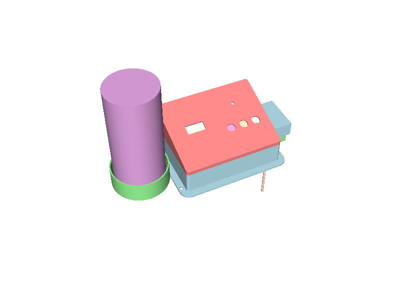
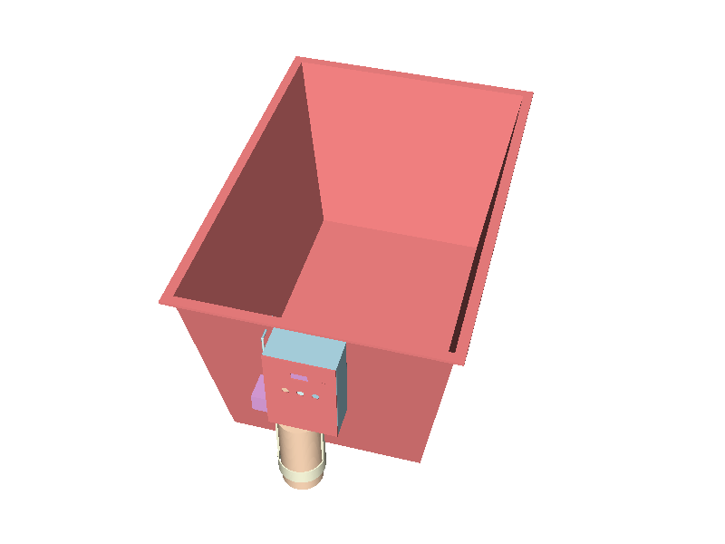
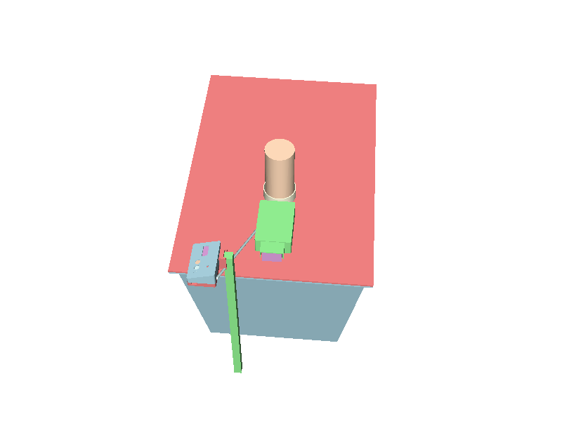
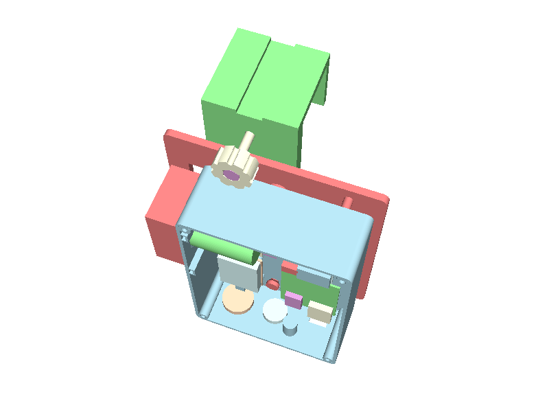
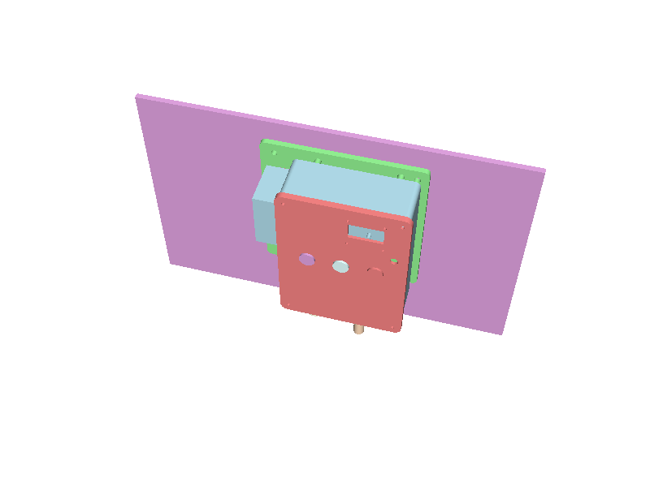
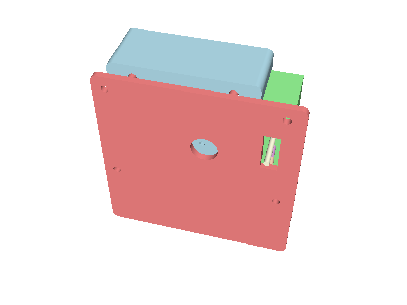
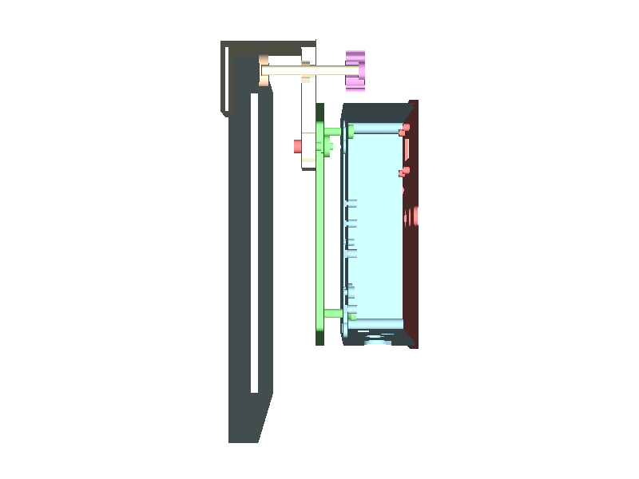
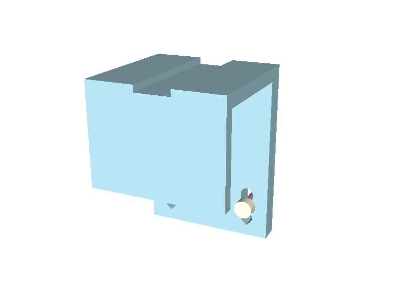

# nutrient_controller

A printed PETG controller box for a hydroponic reservoir. It reads TDS and
water temperature, doses nutrient concentrate with one peristaltic pump, and
shows its state on an OLED with three buttons and an LED. The active revision,
B2, hangs beside any tote or bucket on a clamp over the rim, so the container
is never drilled. The model is parametric build123d code in which every
number is sourced or marked as a design choice, every bought part is an
envelope placed in the assembly, and the checks, not the renders, decide
whether it fits. Nothing has been printed yet.


`NOTES.md` is the working log: the full parts list with sources, every value
still marked PLACEHOLDER, and what comes next.

## The modelling approach

**Every number has a source or says it is a choice.** A dimension in
`params.py` comes from a standard (ISO 273, ISO 4762), a vendor sheet (Lapp,
Kamoer, JST, E-Switch), a board file (Adafruit's Eagle files, Seeed's KiCad
project), or it is a DESIGN choice with a comment. Anything else is marked
PLACEHOLDER. The alternative, typing in numbers that look right, is how the
first printed trays in this repo failed to fit. A value nobody publishes (the
OLED panel's thickness, the HDX rim profile, the pump flange's hole height)
is not measured either. The part is designed so it doesn't depend on it.

**Interfaces that tolerate what isn't published.** This is the idea that
shaped the mechanical design more than any other:
- **Pump flange.** Kamoer draws the hole offset but doesn't dimension it, so the wall holes are slots and the
  nuts slide in channels.
- **Tote wall slope.** It's unknown, so B1's box hangs parallel to the wall and the slope never becomes a
  dimension.
- **Rim profile.** Every tote and bucket differs, so B2's clamp takes any wall or lip from 2 to 35 mm.
- **XIAO ESP32-C3.** It has no mounting holes, so it rides on a Perma-Proto carrier rather than in a cradle that
  would depend on its thickness.

The cost is a little slack in each joint. The gain is that a first print can
fit without a caliper.

**Rough models first, detail second.** Three concepts were built as
envelopes in an afternoon, before any part was sourced. Each answered the
questions that decide a mount: does the lid still lift off, is every opening
above the waterline, does the probe cable reach. Concept B won because only
its lid stays free. Sourcing every part for three concepts would have tripled
the work for two designs that were then dropped.

**Checks decide, renders confirm.** Each printed part checks its own print
orientation, overhangs and material at named points. The assembly then
interference-checks every pair of bought-part envelopes, and each envelope
against each printed part, and runs the motions: the box sliding onto its
keyholes, the clamp at its thinnest and thickest container. A render can hide
a hole (FINDINGS F21); an interference volume of 9 mm³ can't.

**Tests plant the defect they guard against.** A check that never fails
proves nothing. Each assembly test moves a board onto another, shortens the
keyhole slide, or feeds the clamp a 45 mm wall, and asserts the check
catches it. One check was rewritten because a planted defect passed (below).

## Code layout

| file | job |
|---|---|
| `params.py` | every number: bought-part table with sources, fasteners, clearances, the B1/B2 revisions, `derive()`, `validate()` |
| `geom.py` | shared solids: boxes by bounds, cylinders on an axis, teardrops, teardrop slots, hex pockets with a 45° roof |
| `body.py`, `cover.py` | the box and its front cover, each with its print checks |
| `wall_plate.py` | the post plate (both revisions) and B1's backing plate |
| `rim_hook.py` | B2's hook, knob and pad, and where they sit for a given container thickness |
| `assembly.py` | bought-part envelopes, container context, the assembly checks, 3MF and STEP export |
| `concepts.py`, `concept_params.py` | the three rough concepts that picked the direction |
| `tests/` | concepts, B1 and B2, each with planted failures |

## build123d methods

**Algebra mode, positioned primitives.** Every solid is a primitive moved
into place with `Pos(...) * Rot(...) * Box(...)` and combined with `+`, `-`
and `&`. No `BuildPart` context: the parts are mostly boolean stacks, and
algebra mode keeps each cut a one-liner that reads from `derive()`. `geom.py`
wraps the two most common shapes so the part files speak in bounds and axes:

```python
def box(x0, x1, y0, y1, z0, z1):            # a box by its bounds
    return Pos((x0 + x1) / 2, (y0 + y1) / 2, (z0 + z1) / 2) * Box(x1 - x0, y1 - y0, z1 - z0)

def cyl(d, axis, centre, length):            # a cylinder along "x" | "y" | "z"
    rot = {"x": Rot(0, 90, 0), "y": Rot(90, 0, 0), "z": Rot(0, 0, 0)}[axis]
    return Pos(*centre) * rot * Cylinder(d / 2, length)
```

**Profiles for anything that isn't a box.** The hook is one polygon in the
XZ plane, extruded both ways across its width. The pump's nut blocks are a
four-point polygon whose underside is cut at 45° so they print without
support:

```python
prof = Plane.XZ * Polygon((xl0, zl0), (xl1, zl0), (xl1, zt), (xj0, zt), (xj0, zj0),
                          (xj1, zj0), (xj1, zr), (xl0, zr), align=None)
hook = Pos(0, d["hook_y"], 0) * extrude(prof, amount=d["hook_w"] / 2, both=True)
```

**Holes that print sideways.** The body prints on its back, so every hole
through a side or bottom wall is horizontal on the printer. `teardrop()`
builds a circle plus a 45° roof pointing at the print's up direction,
optionally cut flat just above the circle. The cut keeps a cable gland's
flange covering the hole, so it still seals. `slot_teardrop()` does the same
for the pump slots, and `hex_prism(..., apex=...)` does it for a nut pocket
that lies on its side. The overhang check caught the plain hex: a vertex-up
hexagon has 60° roof faces.

**Edge selection, not indices.** Corners are rounded by axis:
`fillet(part.edges().filter_by(Axis.X), r)` rounds the outline seen from the
front. The cover first did this after cutting its drip skirt. That rounded the
skirt's inside corners too, and the assembly check found them reaching
16 mm³ into the body's corners. The cover now rounds its outline, then cuts
the skirt opening as a separately rounded box.

**Print checks on the real solid.** Each part is rotated into its print
orientation and handed to the repo's checks
(`cacad.checks.orientation`, `cacad.checks.overhang`). Declared bridges
(nut-pocket ceilings, the flats cut on the gland holes, the cable groove)
are listed in `derive()` by height, and the check fails if a declared one is
missing, so a stale list can't hide a reorientation.

```python
printed = part.rotate(Axis.Y, -90)                   # body: +x (out of the back) becomes the print's +z
o = dict(d["print_orientation"]["body"], up=(0, 0, 1), bed_z=0.0)
check_declared_orientation(printed, o)
check_overhang(printed, dict(up=(0, 0, 1), bed_z=0.0, max_deg=45.0, nozzle_d=d["nozzle_d"],
                             exceptions=d["body_overhang_exceptions"]))
```

**Pairwise interference, not one big union.** Two bodies are checked with
`cacad.interference_volume(a, b)`, one pair at a time (FINDINGS F7). Contacts
that are the design, such as the pump motor through its wall hole or a
button through the cover, are named in a `CONTACTS` set rather than skipped
by tolerance. Point probes (`cacad.assert_material`) confirm that a hole is
open or a wall is solid at named coordinates.

**Motions as swept or moved solids.** To hang the box, it is raised by the
keyhole slide, and a cylinder the size of a post head is swept along x
through the back plate; the two must not intersect. The clamp is placed by
`clamp_locations(d, c)` for the thinnest, middle and thickest container, and
each placement is checked against the container slab, the box and the cover.

**One mesh per part.** `cacad.export_3mf` writes each printed part, each
envelope and the context as its own named mesh (FINDINGS F15). The slicer
gets separate objects, and the build123d-mcp server renders the file through
`import_cad_file`. That avoids its module cache (F25) and shows the same file
the slicer sees.

**Kernel lessons from this project.** A cylinder exactly tangent to a wall
fuses into a valid single solid whose mesh is not manifold: 3MF export
refused the body until the corner insert columns were sunk 0.6 mm into the
walls (FINDINGS F31). `is_valid` and `single_solid` don't catch it; the export
does.

## The model

### Concepts

Three rough concepts, all on the HDX 27 gal tote, each holding the same
electronics as envelopes:

| | A: box on the lid | B: box on the end wall | C: screen on a post + box on the lid |
|---|---|---|---|
| lid lifts off alone | no | yes | no |
| lowest opening over the waterline | +160 mm | +100 mm | +160 mm |
| TDS probe cable to spare | +420 mm | +480 mm | +158 mm |
| holes in the tote | 7 in the lid | 4 in the wall | 3 in the lid |





B went forward: it is the only one where taking the lid off leaves the
probes, the tube and the electronics where they are.

### The box (B1 and B2)

The box is 110 × 150 × 44 mm and prints on its back. Inside are:
- the DFRobot SEN0244 TDS board, with an ADS1115 reading it;
- the Adafruit MOSFET driver for the pump;
- a Perma-Proto carrying the XIAO ESP32-C3 and the Pololu 5 V regulator.

Each board sits on bosses whose height is derived from a stocked screw. A
nut pocket opens to the back face, and the boss is raised until an M2 × 10
ends inside its nut and 0.4 mm short of the back. The Kamoer NKP pump bolts
outside the left wall with its motor inside. Its tubes leave the head
towards the wall, so no liquid enters the box.

Cables come in from below through Lapp glands, with a drip loop. The M16
gland for the TDS probe is sized so the probe's XH plug (9.3 mm diagonal)
passes through it open. The cover carries the OLED behind a window, three
IP67 buttons and the LED, and has a 3 mm drip skirt over the body's edge.
The box hangs by three keyholes on mushroom posts on a printed plate and
lifts off for service.



### B1: plate bolted through the wall

The post plate bolts flat to the tote's end wall with four M5 bolts through
a backing plate inside the tote. The probe cables leave the tote through one
hole behind the plate. Every hole in the tote sits at least 50 mm above the
waterline. It is the stiffer mount and the cleaner lid, but it means drilling
one particular tote. It stays in `params.py` as the alternative: validated,
not built.




### B2: rim clamp (active)

The post plate bolts to a printed C-hook through two vertical slots, which
set the box top anywhere from 29 to 41 mm below the rim. The hook's bridge
sits on the rim and its inner jaw bears on the inside face. An ISO 4017
M6 × 60, turned by a printed knob, presses a printed pad on the outside. The
throat takes any wall or lip from 2 to 35 mm thick at the screw. The hook is
60 mm wide, so a bucket rim of 150 mm radius leaves only a 3 mm gap across
it. The probe cables and the dosing tube cross the rim in a 16 × 3 mm groove
on the bridge, then run down outside to the glands. The hook prints upside
down on its bridge, so the jaw and leg are plain walls on the printer.




## What the checks caught

Before anything was printed, the assembly checks found:
- an ADS1115 plug running into the pump's nut block;
- the pump flange hitting the cover's drip skirt;
- the skirt's rounded inside corners entering the body;
- the tangent insert columns that broke the mesh.

Each was fixed by moving a number in `params.py`, not by editing geometry by
hand.

One check was itself wrong. Raising the box by the keyhole slide and finding
no overlap only proved the posts sat in the slots, not that their heads
could pass the back plate. A test that planted a short slide passed, which
exposed it. The check now sweeps each post head through the back plate.

## Limits

Nothing has been printed, so every DESIGN clearance is still untested in PETG.
Several bought-part numbers are PLACEHOLDER:
- every board's PCB thickness;
- the OLED panel's thickness;
- the TDS probe's cable diameter;
- the USB-C plug's overmold.

The design tolerates each one (the list and how is in `NOTES.md`), but none
has been confirmed.

B2 has two costs B1 doesn't. The lid rests on the hook's bridge, 6 mm high
there, and a snap-on lid won't latch at that spot. The TDS probe's 830 mm
lead is tight: 53 mm to spare on the HDX tote, 13 mm on a container whose
rim is 200 mm above the water, so anything deeper needs an extension. The
clamp holds by friction and one screw, which makes the hook the first part
for a `cad-design-review` pass.

The firmware (sprout-cut `nutrient-analog-xiao`) needs `activeHigh=true` for
the MOSFET driver. It has no button or LED pins yet.

## Run

```
.venv/bin/python projects/nutrient_controller/params.py     # every derived number, both revisions
.venv/bin/python projects/nutrient_controller/assembly.py   # build, check, out/B2.3mf and out/B2_assembly.step
.venv/bin/python -m pytest -q projects/nutrient_controller
```

Single parts build on their own (`body.py`, `cover.py`, `wall_plate.py`,
`rim_hook.py`), each writing its STEP and STL to `out/`. To build B1 instead,
set `ACTIVE_SIZES = ("B1",)` in `params.py`. Vendor sheets and Eagle files
live in `ref/`, which is gitignored: the sources are named in `params.py`,
but the files are only on the machine that fetched them.
