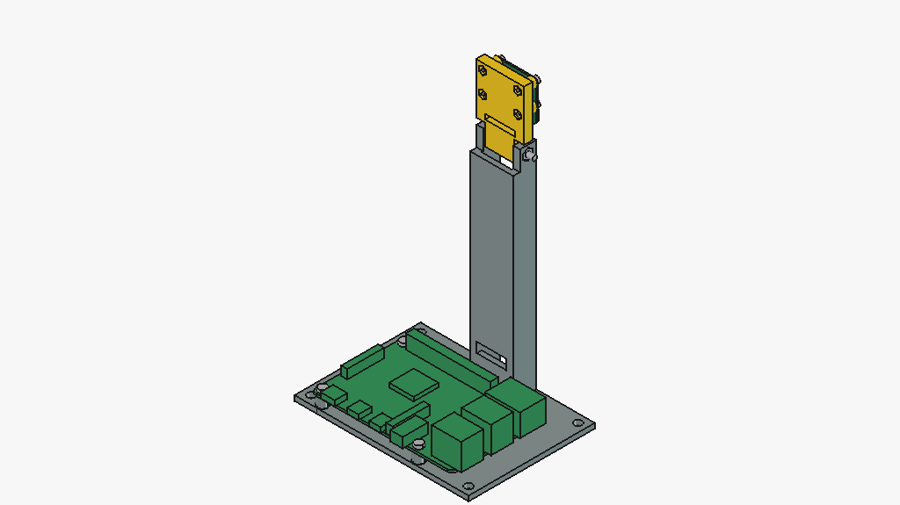
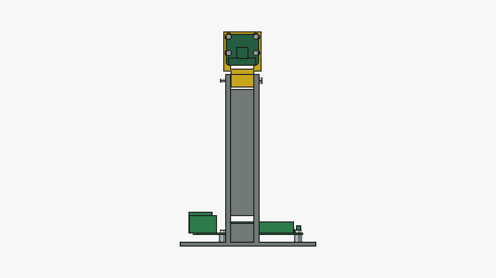
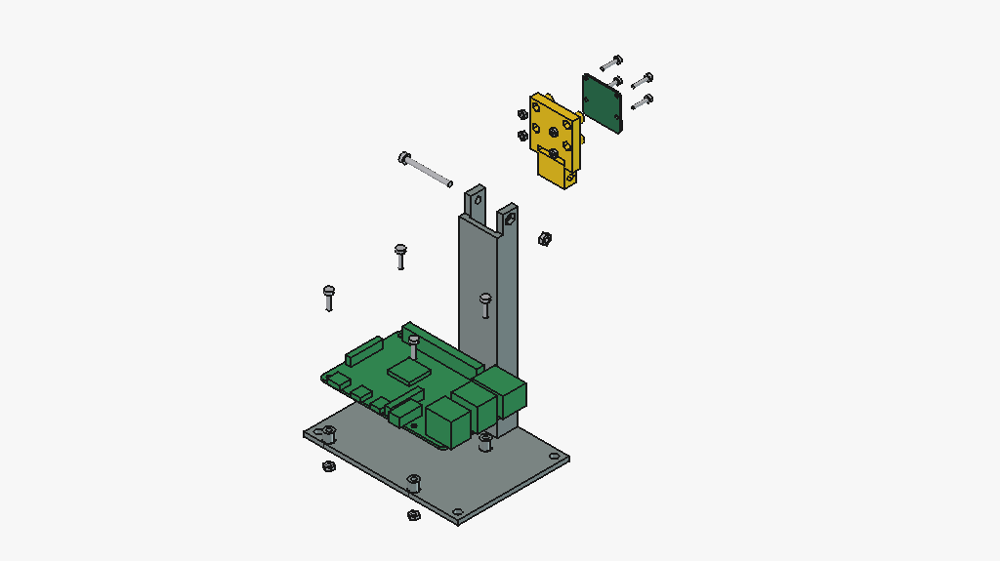

# pi_cam_stand

A printed desk stand for a Pi 4B and a Camera Module 2. It replaces the bought
dev stand camera_reader sits on. The Pi lies flat in the base. The camera
is screwed to a carrier by all four of its holes, on a hinge at the top of a
column, and tilts from straight down to 30° up. Nothing has been printed yet.





## Parts

Two printed parts in PETG, no support:
- `stand.py`: base, Pi bosses and column, printed upright.
- `carrier.py`: the camera plate and hinge knuckle, printed flat on its back.

| Bought | Qty | Source |
|---|---|---|
| Raspberry Pi 4B | 1 | |
| Camera Module 2 (or NoIR) | 1 | |
| 300 mm camera ribbon, Adafruit 1648 | 1 | adafruit.com/product/1648. The camera's 150 mm ribbon is too short. |
| M2 × 10 pan head, ISO 7045, and M2 nut, ISO 4032 | 4 + 4 | camera |
| M2.5 × 10 pan head, ISO 7045, and M2.5 nut, ISO 4032 | 4 + 4 | Pi |
| M3 × 30 pan head, ISO 7045, and M3 nut, ISO 4032 | 1 + 1 | hinge |
| M4 or #8 screws | 4 | optional, to fix the base down |

`params.py` holds every number with its source. `hardware.py` places the Pi and
camera (camera_reader's solids from the Raspberry Pi drawings) and the
fasteners.

## How it goes together

1. Drop an M2.5 nut into each pocket under the base. Screw the Pi down onto the
   bosses.
2. Push an M2 nut into each pocket in the carrier's back. Screw the camera to
   the bosses, connector edge toward the knuckle.
3. Fit the ribbon to the camera. Feed it back through the carrier's slot and
   down inside the column. Bring it out through the window above the GPIO
   header, fold it once and plug it into the CSI connector.
4. Set the knuckle between the cheeks. Put the M3 nut in the +X cheek's pocket
   and the bolt through from the −X side. Tilt the camera where you want it,
   then tighten the bolt until the tilt holds.



## Design

- **Lens height 150 mm at tilt 0**, close to the dev stand's 155. The hinge
  height comes from that.
- **The ribbon sets the column.** The routed path, with the fold, the bends and
  the tilt's arc, is 217 mm. The rule is path ≤ ribbon − 20 mm, so the 300 mm
  cable passes and the 150 mm one fails `validate()`.
- **The camera is held at four points.** M2 screws pass through the board's
  2.2 mm holes and bosses into nuts in the carrier's back. The bosses keep the
  back-side connector 4 mm off the plate. One screw length (10 mm) fits any
  board from 0.8 to 1.6 mm thick, with the tip inside the nut pocket.
- **Friction hinge.** The knuckle clears each cheek by 0.2 mm. Tightening the
  M3 bolt closes that gap and clamps it. Behind the axis the cheeks drop to the
  web's height, so the carrier plate clears them tilting back.
- **Ports stay open.** USB-C, HDMI and audio face the back edge of the base, and
  USB and Ethernet face the side. The SD card comes out the other side. The
  GPIO header is open from above, but the ribbon passes over it, so a HAT
  will not fit.
- **Horizontal holes are teardrops.** The hinge nut pocket has a vertex at the
  top. Its roof faces sit 60° off vertical and are declared, along with the
  nut-pocket ceilings and the 18 mm bridge over the ribbon window.

## What `assembly.py` checks

- All 10 parts and fastener sets clear each other pairwise, and the 6 designed
  contacts touch.
- The carrier, camera and screws clear the stand and Pi at every 5° of tilt
  from −90° to +30°.
- The camera's view meets nothing from +30° down to −70°. At −75° the column
  enters the edge of the picture. Straight down, the Pi and base do too.
- Each part has its declared bed face and no undeclared overhang over 45°.

## Build and check

```
.venv/bin/python projects/pi_cam_stand/params.py            # the design, printed and validated
.venv/bin/python projects/pi_cam_stand/assembly.py          # checks + out/*.step, *.stl, V0.3mf
.venv/bin/python projects/pi_cam_stand/freecad_assembly.py  # out/pi_cam_stand_V0.FCStd, exploded view (needs the RPC server)
.venv/bin/python -m pytest projects/pi_cam_stand
```

## Open

- The camera's back-side connector height is unpublished. The 4 mm bosses
  allow up to 3.5 mm.
- Clamp force and cheek flex are not computed. If the tilt slips, use a nyloc
  nut (ISO 10511) instead and deepen the pocket.
- The column is 26 × 14 mm in section and 133 mm tall. Its stiffness is not
  checked. Expect it to wobble if you tap the camera.
