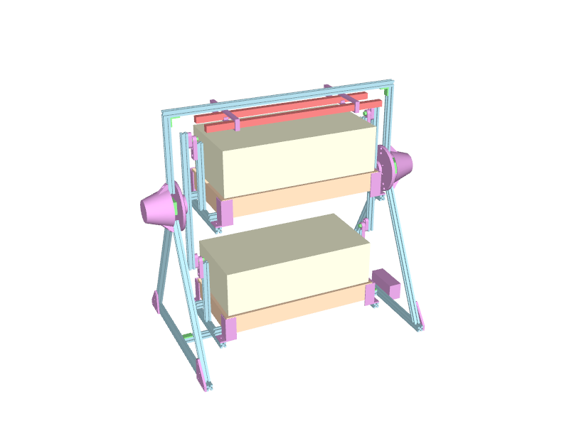
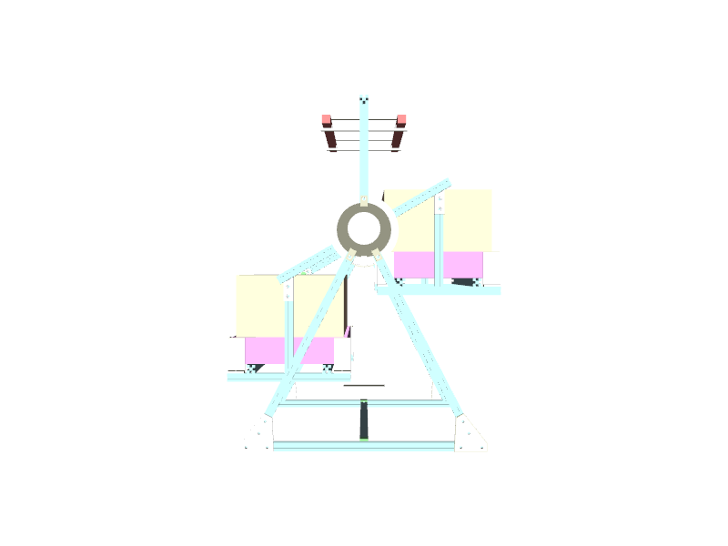

# seedling_wheel

A two-level seedling stand that swaps which 1020 flat sits under the light. Two gravity-hung gondolas ride a
Ferris-wheel rotor between two 2020 A-frame towers. An ESP32 turns the rotor 180° with two NEMA 17 50:1 gearmotors,
one inside each printed nacelle. Nothing crosses the growing volume. Overall:
- 784 mm long, 943 mm over the nacelles;
- 705 mm wide in the sweep, on a 560 mm footprint;
- 813 mm high.

Not printed yet.





## Status

STATUS is `concept`.
- **Passes:**
  - `validate()`.
  - Eight prints with their checks: P1 hub, P2 pivot plate, P3 hanger, P4 tray corner, P5 tower head,
    P7 light hanger, P8 nacelle, P10 leg shoe.
  - An every-degree sweep, and solid overlap checks at 0/45/90/135° with a negative control.
  - Designed contacts, and the tray's free fit.
- **Open:**
  - The gearbox drawing (shaft, face holes, pilot), the hub hole pattern and the light bar length are UNVERIFIED.
  - P9 (electronics pod) is an envelope; P6 (home sensor) is not drawn. See `SPEC.md`.

## Sources

`SPEC.md` names every bought part.
- Each number in `params.py` is a (value, TAG, source) triple: VENDOR (Bootstrap Farmer tray, Misumi HFS5, the
  StepperOnline MG50 spec table as relisted, Pololu #2693), STANDARD (ISO 7379, 7089, 4032, 4762, 273, NEMA ICS 16)
  or DESIGN.
- Estimated values are tagged UNVERIFIED and listed by `params.py` under `UNVERIFIED:`. None of them may pass a part
  that has to fit.

## Run

```
.venv/bin/python projects/seedling_wheel/params.py         # the design, validated
.venv/bin/python projects/seedling_wheel/p1_hub.py         # one part -> out/*.step, *.stl (also p2..p5, p7, p8, p10)
.venv/bin/python projects/seedling_wheel/assembly.py [deg] # overlap checks -> out/seedling_wheel_<deg>.step, .3mf
.venv/bin/python -m pytest projects/seedling_wheel
```
