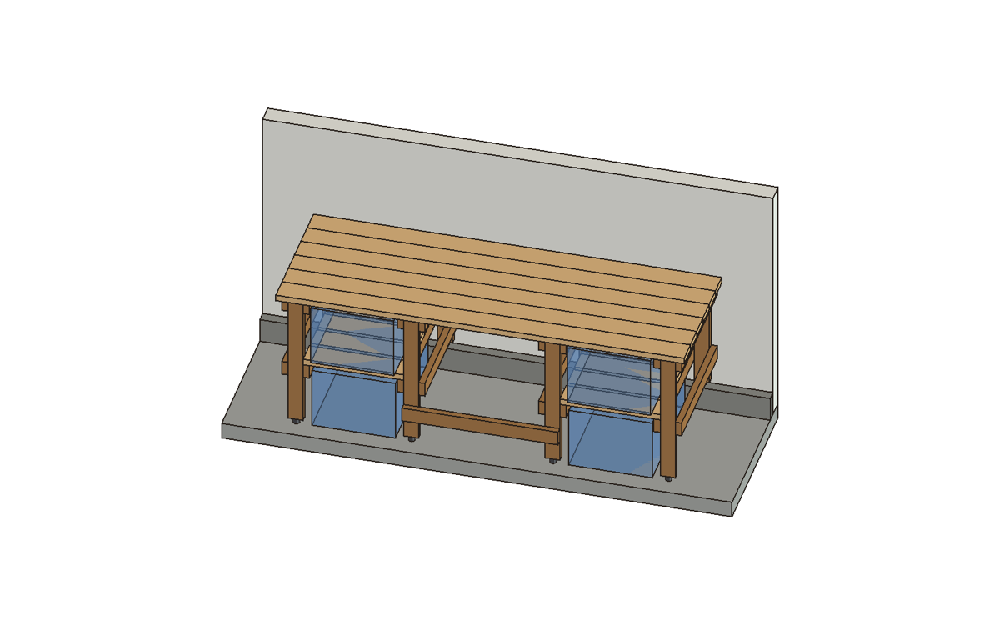
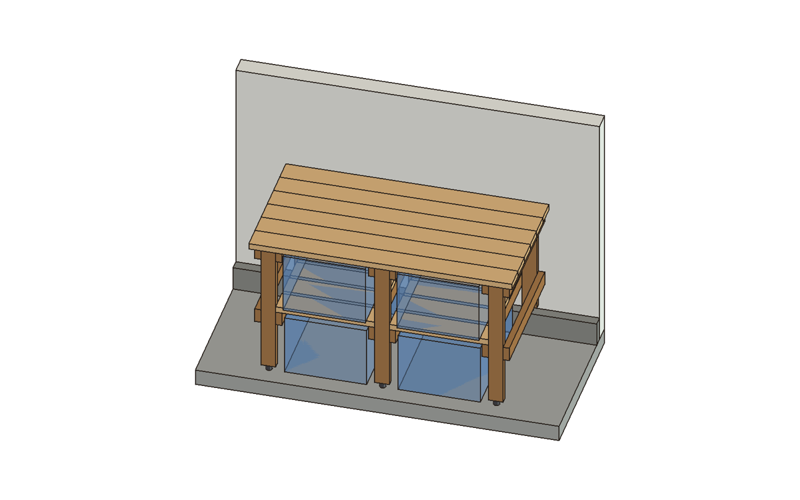
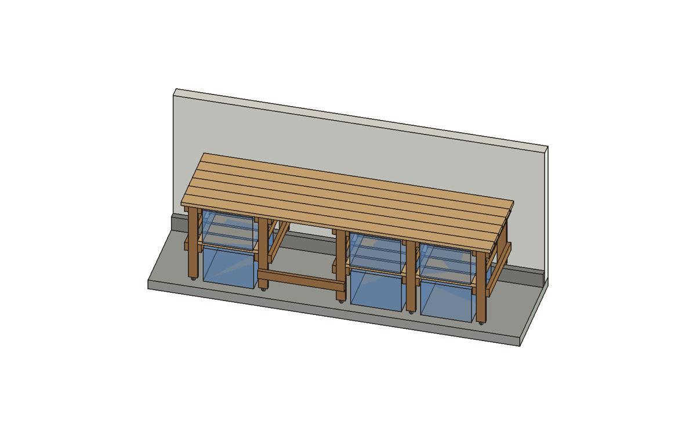
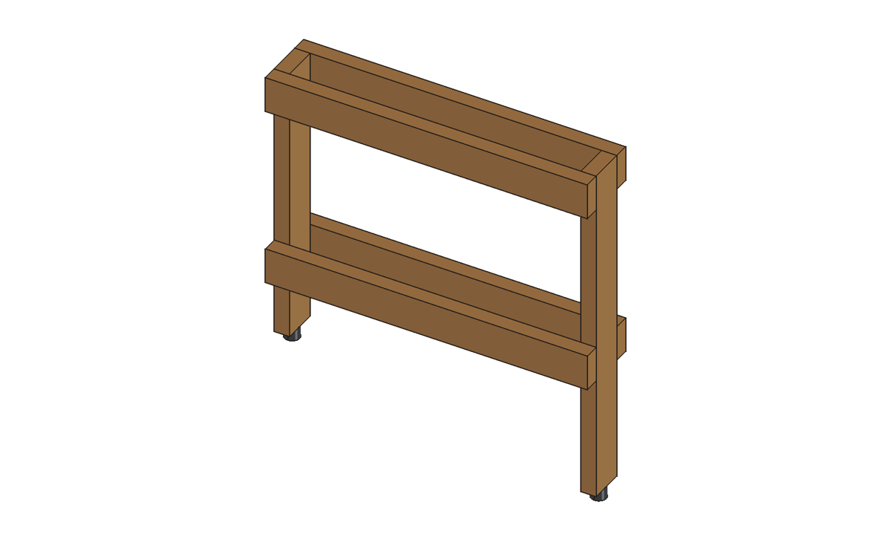
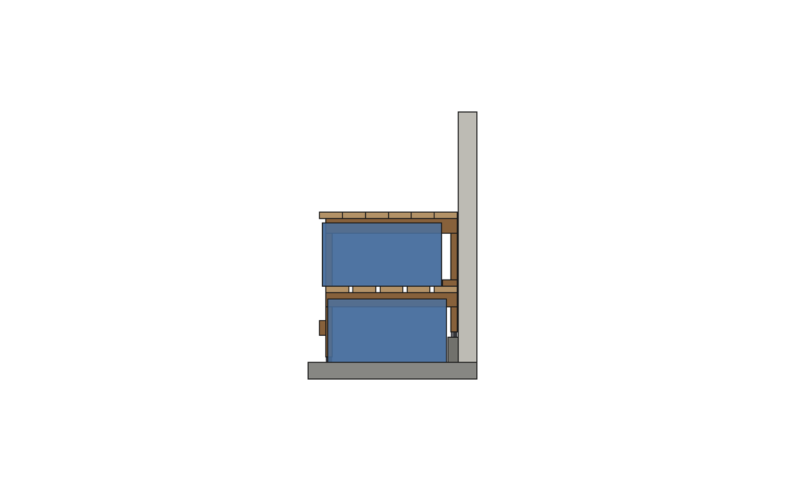

# Tote bench

A workbench for the garage lip wall, built with a miter saw and one screw.
HDX 27 gal totes stand two high in columns, handle out: the lower one on the
slab, the upper one on a 2x6 slat shelf. The chair versions leave a knee
space with a footrest. It replaces projects/workbench: no plywood, no rips.



## Pick a version

| version | top | totes | chair | buy |
|---|---|---|---|---|
| `compact` | 62-3/4 x 33 in | 4 | no | 7 x 2x4 8 ft, 7 x 2x6 8 ft, 6 feet |
| `desk` | 96 x 33 in | 4 | 26-3/4 in knee space | 9 x 2x4 8 ft, 9 x 2x6 8 ft (6 used uncut), 8 feet |
| `long` | 120 x 33 in | 6 | 23-5/8 in knee space | 12 x 2x4 8 ft, 6 x 2x6 10 ft (uncut) + 4 x 2x6 8 ft, 10 feet |

All are 36 in high. Each version has its own build sheet: buy list, stop-block
cut list, stick-by-stick plan, and assembly steps with every mark and every
screw. Start with [build/desk.md](build/desk.md), or see
[build/compact.md](build/compact.md) and [build/long.md](build/long.md).




## Why it's easy

- **Two lumber sizes, square crosscuts only.** 2x4 and 2x6, cut to stop-block
  lengths that read off a tape (33-1/4, 31-1/2, 27-1/4, 23-5/8 in). No rips,
  no angles, no plywood. `validate()` refuses any board narrower than its
  stock and any length that isn't a 1/16 in reading.
- **One screw.** #8 x 2-1/2 in at every joint. Each joint goes through 1-1/2 in
  of one board and bites 1 in into the next, which is the 6-diameter minimum.
  The model checks every screw against the boards: in its own board, into its
  target, and clear of every other screw.
- **Identical ladders.** A ladder is a front leg, a back leg and four rails.
  Build them all the same way, flat on the floor. The only mark is the mid
  rail, 17-3/4 in down from the leg tops.
- **The parts locate each other.** Slat ends butt against the legs, so the
  slats set each tote column's width. The footrest sets the knee space. The
  chair versions use uncut planks, so there are no cuts on the top at all.



## How it uses the garage

The back legs stand on the concrete lip (projects/garage), on leveling feet,
1/4 in off the wall. The lip's face stops the lower tote. A 2x4 laid flat on
the back slat stops the upper one. Each foot adjusts ±1/2 in, which covers the
uneven slab and the lip's "about 6 in" height. The lower tote still has 1 in
over its lid with the slab 1/2 in high under it.



## What changed from projects/workbench

| | workbench | tote_bench |
|---|---|---|
| materials | 2x4 + two 4x8 plywood sheets (ripped) | 2x4 + 2x6, crosscuts only |
| screws | three lengths | one |
| totes | long side out, 24 in deep top | short side out, handle toward you, 33 in deep top |
| upper shelf | plywood | 2x6 slats |
| top | glued two-layer ply | six 2x6 planks, uncut for the chair versions |
| chair | no | knee space + footrest (`desk`, `long`) |

```
params.py        LUMBER (PS 20), COMMON clearances, VERSIONS; derive(), validate(), report()
bench.py         boards, feet, totes, screw shanks, garage; check_bench
build_sheet.py   -> build/<version>.md (committed; a test fails if it is stale)
freecad_view.py  each version in its garage; renders out/<version>_{room,front}.png, desk section and ladder
tests/           geometry + function, identical ladders, one screw, sheets current, controls
```

```
.venv/bin/python projects/tote_bench/params.py        # all versions: sizes, governance, buy counts
.venv/bin/python projects/tote_bench/bench.py         # -> out/*.step, .stl
.venv/bin/python projects/tote_bench/build_sheet.py   # -> build/*.md
.venv/bin/python -m pytest projects/tote_bench -q
.venv/bin/python projects/tote_bench/freecad_view.py  # FreeCAD open, MCP Addon RPC server started
```

## Not known yet

Each is marked UNVERIFIED and has an allowance in the design:

- **Lip size, 2.5 x 6 in:** the owner's rough figures. The back feet need
  2 in of lip depth, and their travel covers ±1/2 in of lip height.
- **Floor:** ±1/2 in is an allowance, not a reading.
- **Leveling foot:** no product chosen. Any 3/8-16 stud leveler with at
  least 1 in of travel and a pad no wider than 1-1/2 in will do.
- **Wall length:** not given. Check the version you pick fits along the lip.

Not modelled:

- **Racking along the wall:** resisted by the legs' 3-1/2 in width and the
  screwed plank top. For heavy pounding, screw the top rails into wall
  studs.
- **Tote taper:** the totes are modelled as the label's top envelope with
  the lid on. The real tote is smaller below, so every clearance here is a
  minimum.
