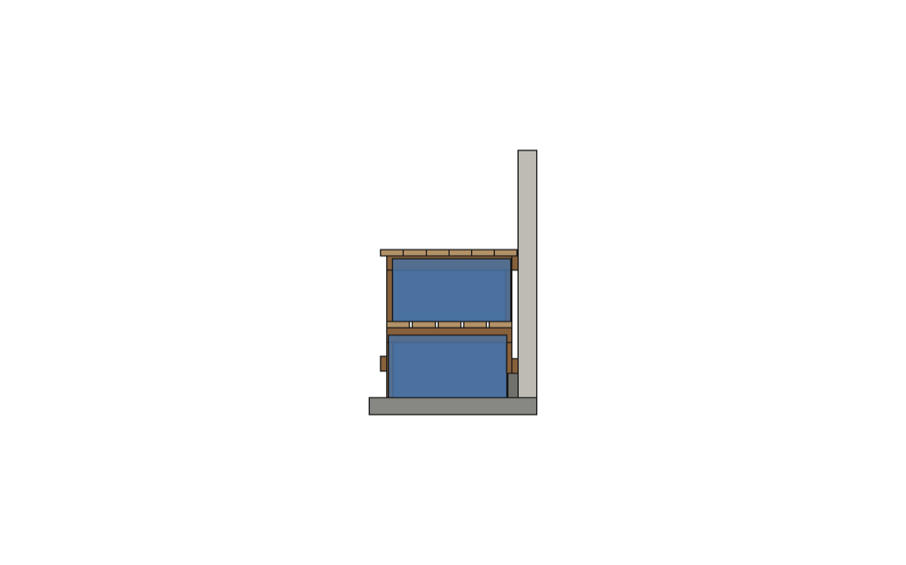

# Tote bench

A 10 ft workbench on the garage lip wall: 120 x 33 in, 36 in high. Six HDX
27 gal totes sit in three columns, handle out, and there's a 23-5/8 in knee
space for a stool with a footrest. It is designed in the order it is built.
The back frame goes on the wall first and everything else hangs from it. It
uses 2x4 and 2x6 only, square crosscuts only, no plywood and no leveling feet.


**Build it from [build/long.md](build/long.md):** buy list, stop-block cut
list, then five stages with every mark and every screw.

## The build order

1. **Back frame on the wall.** A sill and a top ledger, both whole 10 ft 2x4s
   on edge, with five back legs screwed across them. Build it flat on the
   floor, then stand it on the lip tight to the drywall. Shim the sill until
   the ledger is level, then screw both boards into every stud with #10 x
   3-1/2 in screws. From here on, this frame is the level line and the anchor.
2. **Rails.** Four per back leg: a top pair flush with the leg top and a mid
   pair 17-1/2 in down.
3. **Front legs, cut in place.** Level each top rail front to back. Stand a
   37 in blank on the floor between the rails, mark the rail top on it, cut,
   screw. The floor's slope and the lip's rough height both go into that one
   cut. That's what replaces leveling feet.
4. **Shelf slats and footrest.**
5. **Top:** six whole 10 ft 2x6 planks.


## How the wall and the lip are used

- **The sill stands on the lip.** It's on edge, so it's 1-1/2 in deep, fully
  on a 2-1/2 in lip and tight to the drywall. It and the back legs carry the
  back of the bench down onto the concrete. Make the sill pressure-treated.
- **The sill and ledger are screwed into the studs** through the drywall,
  2 per stud each. The screws are 3-1/2 in long, so they bite 1-3/8 in into
  the stud even through 5/8 in drywall. The bench can't tip, rack along the
  wall or walk.
- **Wall screws never hit the leg screws.** The wall screws go in at 5/8 and
  2-1/8 in below each board's top edge, the leg screws at 1-3/8 and 2-7/8 in.
  The rows are 3/4 in apart, so it doesn't matter where a stud falls.
- **The lip face stops the lower tote.** The top ledger stops the upper one,
  catching it 2-11/16 in below its lid. There are no stop boards.



## Checked in the model

- Nothing overlaps: wood, totes, the lip, the drywall or the slab. The sill
  and back legs stand on the lip, and the front legs stand on the slab.
- The fronts and the knee space are open.
- Each tote, pushed further, hits its stop.
- Each of the 284 wood screws passes 1-1/2 in through its board, bites 1 in
  into the next, and meets no other screw.
- The ladders are identical.
- Every board belongs to exactly one assembly stage.
- The build sheet is regenerated and compared.
- Controls make the checks fail on purpose.

```
params.py        LUMBER (PS 20), WALL_SCREW, COMMON, VERSIONS; derive(), validate(), report()
bench.py         boards, totes, screw shanks, garage; check_bench
build_sheet.py   STAGES (the build order) -> build/long.md (committed; a test fails if it is stale)
freecad_view.py  the bench in its garage; one render per stage, the totes, front and section
tests/           geometry + function, build order, sheet current, controls
```

```
.venv/bin/python projects/tote_bench/params.py        # sizes, governance, buy counts
.venv/bin/python projects/tote_bench/bench.py         # -> out/*.step, .stl
.venv/bin/python projects/tote_bench/build_sheet.py   # -> build/long.md
.venv/bin/python -m pytest projects/tote_bench -q
.venv/bin/python projects/tote_bench/freecad_view.py  # FreeCAD open, MCP Addon RPC server started
```

## Not known yet

Each is marked UNVERIFIED and has an allowance in the design:

- **Lip, 2.5 x 6 in:** the owner's rough figures. Its height goes into the
  front-leg cut and the sill shims. The sill needs 1-3/4 in of its depth.
- **Floor:** ±1/2 in is an allowance. The front-leg cut takes it up.
- **Wall:** drywall up to 5/8 in over wood studs, at about 16 in spacing.
  Use a stud finder and screw at every stud it finds.
- **Wall length:** the bench needs 120 in along the lip.

The compact and desk versions, and their build sheets, are in git history
(commit 64c12c0).
