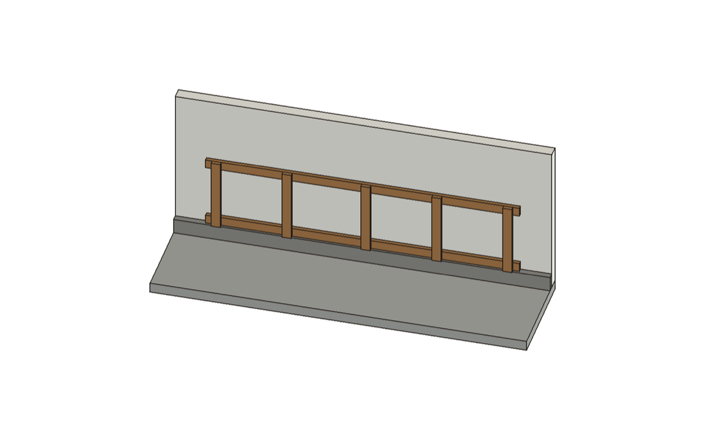
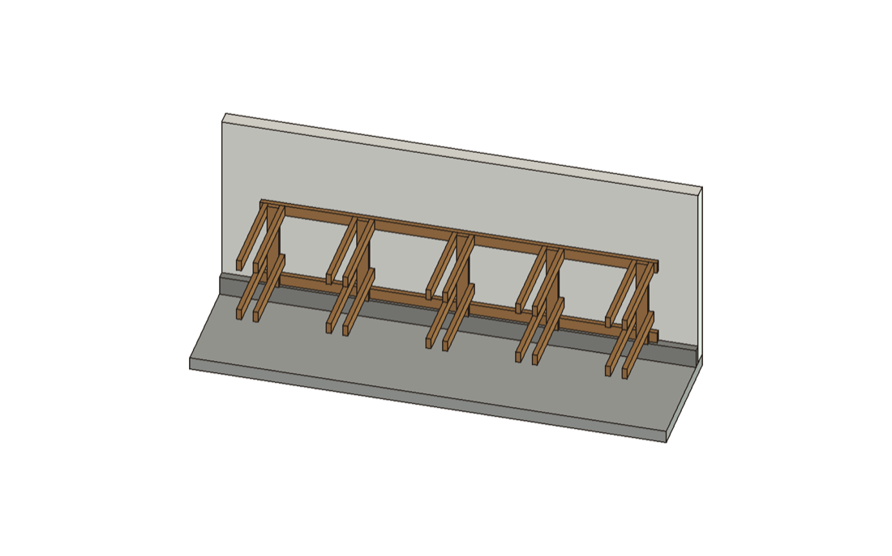
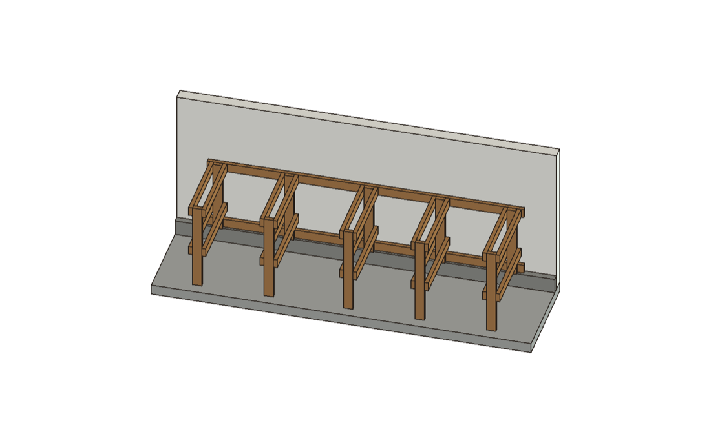
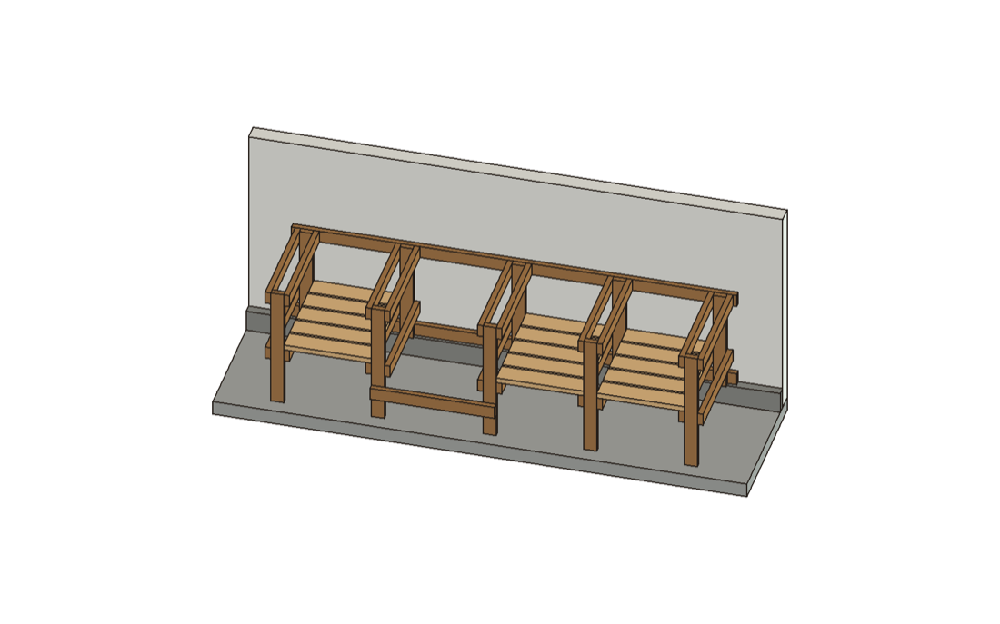
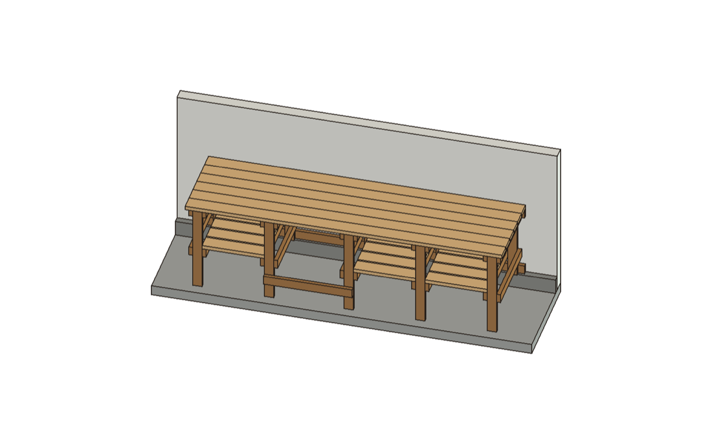
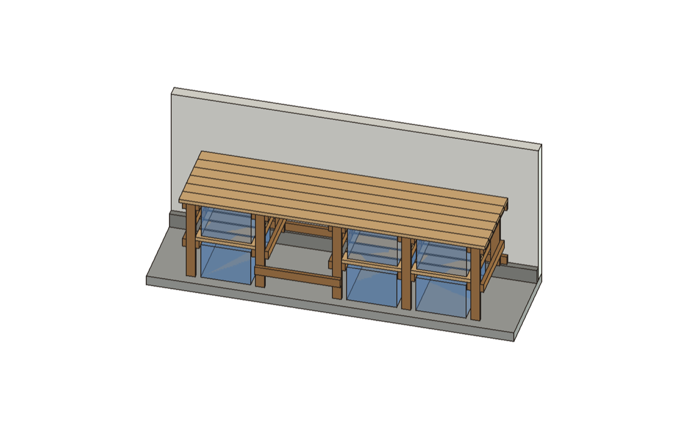

# Tote bench `long`: build sheet

Three tote columns and a knee space: 6 totes and a stool, on uncut 10 ft boards. Top 120 in long x 33 in deep, 36 in high. Columns, left to right: tote | tote | knee | tote. Generated by `build_sheet.py` from `params.py`; change params, not this file.

The order matters. The back frame goes on the wall first and becomes the level line. Everything after it
hangs from it, and the front legs are cut to fit at the end, so the uneven floor never needs measuring.

## Buy

- 2 x 2x4, 10 ft: sill and top ledger, used whole. Make the sill pressure-treated: it sits on concrete. Sight down each board and pick straight ones.
- 12 x 2x4, 8 ft: legs, rails, footrest. Sight down each board and pick straight ones.
- 6 x 2x6, 10 ft: top planks, used whole. Sight down each board and pick straight ones.
- 4 x 2x6, 8 ft: shelf slats. Sight down each board and pick straight ones.
- #8 wood screw, 2-1/2 in: the bench takes 284; buy 313 or more
- #10 wood screw, 3-1/2 in, for the wall: 2 per stud through each of the sill and the ledger, about 32 at 16 in stud spacing
- A few composite shims, for leveling the sill on the lip
- 6 x HDX 27 gal Tough Storage Tote

Tools: a miter saw that crosscuts a 2x6 (5-1/2 in) square, drill/driver, stud finder, 4 ft level, tape, square, two clamps.

## Cut

Every cut is square across the board. Clamp a stop block to the saw fence at each length and cut all of that
length before moving the block. The sill, the ledger and the planks are whole 10 ft boards and get no cuts.

| set stop at | cut | from | for |
|---|---|---|---|
| 37 in | 5 | 2x4 | front leg blank (trimmed in stage 3) |
| 33-5/8 in | 1 | 2x4 | footrest |
| 30-1/4 in | 20 | 2x4 | rail |
| 28-1/2 in | 5 | 2x4 | back leg |
| 23-5/8 in | 15 | 2x6 | shelf slat |

Stick by stick (1/8 in kerf allowed per cut):

- 2x4 #1: 37 in front leg blank, 37 in front leg blank; offcut 21-3/4 in
- 2x4 #2: 37 in front leg blank, 37 in front leg blank; offcut 21-3/4 in
- 2x4 #3: 37 in front leg blank, 33-5/8 in footrest; offcut 25-1/8 in
- 2x4 #4: 30-1/4 in rail, 30-1/4 in rail, 30-1/4 in rail; offcut 4-7/8 in
- 2x4 #5: 30-1/4 in rail, 30-1/4 in rail, 30-1/4 in rail; offcut 4-7/8 in
- 2x4 #6: 30-1/4 in rail, 30-1/4 in rail, 30-1/4 in rail; offcut 4-7/8 in
- 2x4 #7: 30-1/4 in rail, 30-1/4 in rail, 30-1/4 in rail; offcut 4-7/8 in
- 2x4 #8: 30-1/4 in rail, 30-1/4 in rail, 30-1/4 in rail; offcut 4-7/8 in
- 2x4 #9: 30-1/4 in rail, 30-1/4 in rail, 30-1/4 in rail; offcut 4-7/8 in
- 2x4 #10: 30-1/4 in rail, 30-1/4 in rail, 28-1/2 in back leg; offcut 6-5/8 in
- 2x4 #11: 28-1/2 in back leg, 28-1/2 in back leg, 28-1/2 in back leg; offcut 10-1/8 in
- 2x4 #12: 28-1/2 in back leg; offcut 67-3/8 in
- 2x6 #1: 23-5/8 in shelf slat, 23-5/8 in shelf slat, 23-5/8 in shelf slat, 23-5/8 in shelf slat; offcut 1 in
- 2x6 #2: 23-5/8 in shelf slat, 23-5/8 in shelf slat, 23-5/8 in shelf slat, 23-5/8 in shelf slat; offcut 1 in
- 2x6 #3: 23-5/8 in shelf slat, 23-5/8 in shelf slat, 23-5/8 in shelf slat, 23-5/8 in shelf slat; offcut 1 in
- 2x6 #4: 23-5/8 in shelf slat, 23-5/8 in shelf slat, 23-5/8 in shelf slat; offcut 24-3/4 in

Drill a pilot hole for every screw within 2 in of a board's end, so the pine does not split.

## Stage 1: Back frame on the wall

1. Find the studs with a stud finder and mark each one on the wall, above bench height and just above the lip.
2. Lay the sill and the ledger on the floor on their wide faces, parallel, the same edge toward you. Space them so their far edges are 28-1/2 in apart (the frame's full height).
3. Mark the back legs' left edges on both boards, from the left end: 2-1/2 in, 29-5/8 in, 56-3/4 in, 86-7/8 in, 114 in.
4. Lay a back leg (28-1/2 in) across both boards at each mark, its ends flush with the boards' far edges. Square it to the boards.
5. Screw each leg to each board with 2 screws on the leg's centre line, at 1-3/8 in and 2-7/8 in from the board's far edge: 20 in all.
6. Stand the frame up on the lip, legs facing the room and the sill tight to the drywall. Put a level on the ledger and shim under the sill until it reads level along its length.
7. Drive 2 wall screws through the sill and 2 through the ledger at every stud, at 5/8 in and 2-1/8 in below each board's top edge. Those rows never meet the leg screws, wherever a stud falls.

## Stage 2: Rails on the back legs

Each back leg takes four 30-1/4 in rails: a top pair and a mid pair, one on each face.

1. Top rails: top edge flush with the leg top, back end tight against the ledger.
2. Mid rails: top edge 17-1/2 in below the leg top, back end flush with the leg's back face.
3. 2 screws through each rail into the leg, at 1-1/2 in and 2-3/4 in below the rail's top edge, centred on the leg: 40 in all.
4. The rails stick out into the room. Prop each pair's front end on a scrap, or have a helper hold it, until stage 3.

## Stage 3: Front legs, cut in place

For each rail pair, one at a time:

1. Put a level on the top rail, front to back, and set the front end level. Clamp the rails to a front leg blank stood between them on the floor, flush with the rails' front ends.
2. Mark the top rail's top edge on the blank. Unclamp it, cut on the mark, and put it back on the floor between the rails.
3. Re-check level, then 2 screws through each rail into the leg, at 1-1/2 in and 2-3/4 in below the rail's top edge: 8 per leg, 40 in all.
On a level floor the legs come out about 34-1/2 in. Each one takes up whatever the floor and the lip do at that spot.

## Stage 4: Shelf slats and footrest

1. In each tote column, lay 5 slats flat across the mid rails. The ends butt against the legs. Put the back slat flush with the back legs' back faces and the front slat flush with the front legs. Space the rest evenly (11/16 in gaps).
2. 2 screws down through each slat into each rail, centred on the rail: 60 in all.
3. Footrest (33-5/8 in): on edge across the front faces of the two front legs either side of the knee space, ends flush with the legs' far edges, top edge 10 in off the floor. 2 screws into each leg at 1-1/2 in and 2-3/4 in below its top edge: 4 in all.

## Stage 5: Top planks

1. Lay the 6 planks across the ledger, the leg tops and the top rails. The back plank goes 1/4 in off the drywall, the rest tight to it, ends flush with the frame's ends. The front plank overhangs the front legs by 1-1/2 in.
2. 2 screws down through each plank into every top rail it crosses, centred on the rail: 120 in all.

## Totes

Lower totes: handle out, slide in on the slab until the back touches the lip. Upper totes: slide in on the slats until the back touches the ledger, which catches it by 2-11/16 in.

## Check

- Lower tote lid to the slats: 1-13/16 in, and at least 13/16 in even with the lip 1/2 in low and the slab 1/2 in high under the tote.
- Upper tote lid to the planks: 13/16 in.
- Wall screws bite 1-3/8 in into the studs through 5/8 in drywall. That's more than the 6-diameter minimum.
- Every one of the 284 wood screws is checked in the model: it passes 1-1/2 in through its board, bites 1 in into the next, and meets no other screw.

Not measured, so the build allows for each: lip 2-1/2 x 6 in: owner's rough figures. Its height goes into the front-leg cut and shims under the sill; the sill needs 1-3/4 in of its depth; floor +-1/2 in: an allowance, taken up by the front-leg cut; drywall up to 5/8 in over wood studs: sets the wall screw length; wall length: the bench needs 120 in along the lip.
