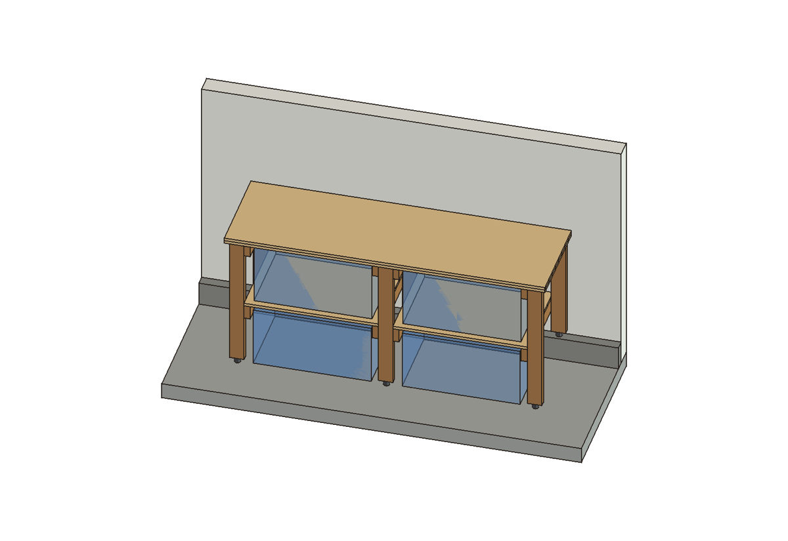
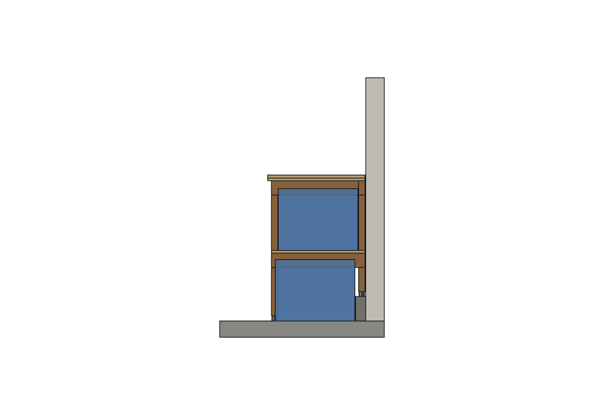
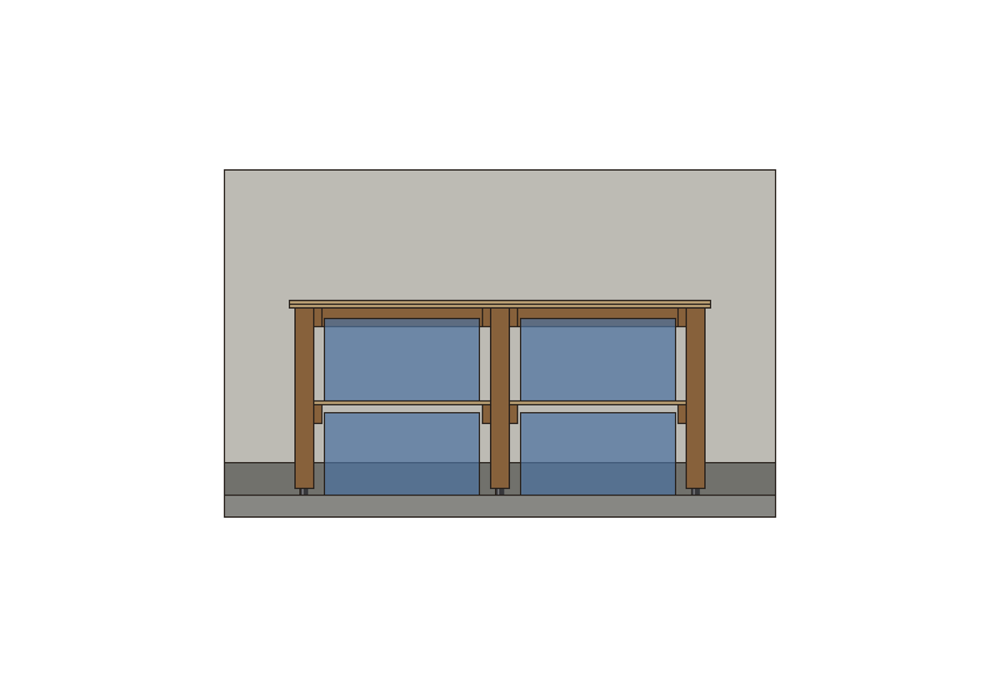

# Workbench

A 77.7 x 24 in bench, 36 in high, along the garage wall with the concrete
lip. Under the top, two bays hold four HDX 27 gal totes, two high, that slide
out like drawers. It's a 2x4 frame with a two-layer 3/4 in plywood top. Lumber,
not a print. You need five 8 ft 2x4s, two 4x8 sheets of plywood and six
leveling feet.



## How the lip is used

The lip (projects/garage: concrete, about 2.5 in deep and 6 in tall, along
the whole wall) does three jobs:

- **The back legs stand on it.** They are 6 in shorter, sit on concrete
  above any water on the slab, and let the top reach the wall with no gap
  behind it.
- **Its face stops the lower tote.** Push the tote in until it touches the
  concrete.
- **The bench can't slide or tip backward.** The back legs sit against the
  wall on the lip.

The upper tote is stopped by a 2x4 stretcher under the back of the top. It
hangs 1.56 in below the top of the tote's lid.



## The floor

Every leg ends in a 3/8-16 stud leveling foot, set mid-travel. The feet take
up the uneven slab and the "about 6 in" lip height, ±0.5 in each, so neither
has to be measured. The lower tote sits on the slab. The shelf above it
leaves 1 in over its lid even where the slab is 0.5 in high.



## Structure

- **Legs:** 2x4 with the 3.5 in face along the wall. Racking along the wall
  bends them about their strong axis between the shelf and the top.
- **Rails:** 2x4 on edge, front leg to back leg, at shelf and top level,
  screwed to each leg's bay-side face. Each joint takes two #8 x 2-1/2 in
  screws. In the middle legs the screws come in from both faces and their
  tips end 38 mm apart.
- **Shelf and top:** the shelf and the top rest on the rails. Nothing crosses
  the front, so between the two totes there is only one ply thickness plus
  clearance.
- **Top:** layer 1 is screwed down to the rails and stretchers, and layer 2
  is glued over it. That hides the screw heads.

```
params.py        PLY (PS 1-19), FOOT (UNVERIFIED), COMMON clearances, BENCHES; derive(), validate(), report()
bench.py         build_bench (one solid per member), build_feet, build_totes, build_garage, check_bench
freecad_view.py  STEPs -> FreeCAD with the garage, positions checked against params, section through bay 0,
                 renders out/render_{iso,front,section}.png, saves out/workbench_<bench>.FCStd
tests/           geometry + function, the lip and slab under the feet, controls that make the checks fail
```

```
.venv/bin/python projects/workbench/params.py         # design review, cut list, buy list
.venv/bin/python projects/workbench/bench.py          # -> out/*.step, .stl (bench, feet, totes, garage)
.venv/bin/python -m pytest projects/workbench -q
.venv/bin/python projects/workbench/freecad_view.py   # FreeCAD open, MCP Addon RPC server started
```

## Not known yet

These are marked UNVERIFIED in params. The design has an allowance for each:

- **The lip's 2.5 x 6 in:** the owner's rough figures. The back feet keep at
  least 0.25 in from the lip's front edge, and their travel covers ±0.5 in
  of height. If the lip is shallower than 2 in, `validate()` refuses the
  design.
- **Floor flatness:** ±0.5 in is an allowance, not a measurement.
- **Leveling foot:** no product chosen. Use any 3/8-16 stud leveler with a
  tee nut, at least 1 in of travel and a pad no wider than 1.5 in.
- **Wall length:** not given. The bench needs 77.7 in clear along the lip.
  The garage model has no beams, poles or door track yet.

Not modelled:

- **Tote taper:** the totes are modelled as the label's top envelope with the
  lid on. The real tote tapers, so its back wall may tuck over the lip a
  little. That only adds clearance.
- **Wall anchor:** for a bench you pound on, a couple of screws through the
  stretchers into wall studs is worth adding once you know where the studs
  are.
